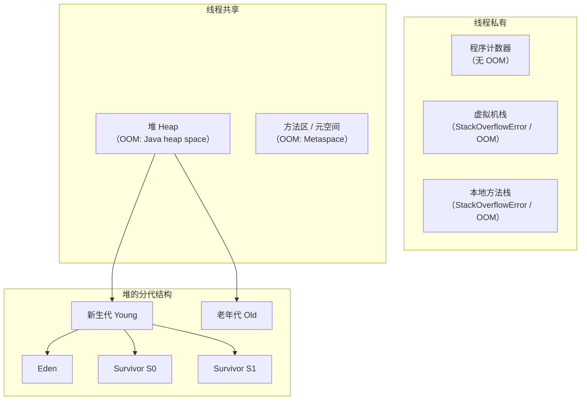

# JVM 内存区域

## 面试常见问法

- JVM 运行时数据区有哪些？
- 堆和栈有什么区别？
- 方法区和元空间是什么关系？
- 哪些区域会发生 OOM？
- 程序计数器为什么不会 OOM？

## 核心回答

JVM 运行时数据区分为线程私有和线程共享两大类。线程私有的有程序计数器、虚拟机栈和本地方法栈；线程共享的有堆和方法区（JDK 8 之后由元空间实现）。堆是对象分配的主要区域，也是 GC 的主战场。虚拟机栈存储方法调用的栈帧，每个栈帧包含局部变量表、操作数栈、动态链接和方法返回地址。除了程序计数器，其他区域都可能发生 OOM。

## 背景

JVM 内存区域的划分是理解 Java 内存管理、垃圾回收、线上 OOM 排查和性能调优的基础。后端开发中遇到的堆内存溢出、栈溢出、元空间溢出等问题都需要先理解各区域的职责和生命周期。面试中这通常是 JVM 考察的第一个问题，从这里切入后面试官会追问堆的分代结构、GC 流程、OOM 排查等更深的话题。

## 核心概念



### 各区域详解

| 区域 | 线程共享 | 存储内容 | 异常 |
|---|---|---|---|
| 程序计数器 | 私有 | 当前线程执行的字节码行号 | 无 |
| 虚拟机栈 | 私有 | 栈帧（局部变量表、操作数栈、动态链接、返回地址） | StackOverflowError / OOM |
| 本地方法栈 | 私有 | Native 方法调用信息 | StackOverflowError / OOM |
| 堆 | 共享 | 对象实例和数组 | OOM: Java heap space |
| 方法区（元空间） | 共享 | 类元数据、运行时常量池、方法元信息、JIT 编译后的代码等 | OOM: Metaspace |

### 堆的分代结构

新生代分为 Eden 区和两个 Survivor 区（S0、S1）。大部分对象在 Eden 区分配，Minor GC 后存活对象进入 Survivor 区，经过多次 GC 后晋升到老年代。默认比例 Eden:S0:S1 = 8:1:1，可通过 `-XX:SurvivorRatio` 调整。

## 项目结合

排查线上 OOM 时，首先需要判断是哪个内存区域溢出，然后针对性地分析。

```java
/**
 * 模拟堆内存溢出，用于验证 OOM 排查流程
 * 启动参数：-Xmx32m -XX:+HeapDumpOnOutOfMemoryError -XX:HeapDumpPath=/tmp/heapdump.hprof
 */
public class HeapOOMDemo {
    public static void main(String[] args) {
        List<byte[]> list = new ArrayList<>();
        while (true) {
            // 不断分配 1MB 数组，模拟内存泄漏场景
            list.add(new byte[1024 * 1024]);
        }
    }
}
```

```java
/**
 * 模拟栈溢出，常见于无限递归
 */
public class StackOverflowDemo {
    private int depth = 0;

    public void recursiveCall() {
        depth++;
        // 无终止条件的递归会耗尽虚拟机栈深度
        recursiveCall();
    }
}
```

## 深入追问

- **程序计数器为什么不会 OOM？** 程序计数器是一块很小的内存空间，只存储当前线程执行的字节码指令地址（如果是 Native 方法则为空）。它的大小固定且极小，JVM 规范中是唯一没有规定 `OutOfMemoryError` 的区域。

- **方法区和元空间的关系？** 方法区是 JVM 规范中的逻辑概念。HotSpot 在 JDK 7 及之前主要用永久代（PermGen）实现，JDK 8 移除永久代，改用元空间（Metaspace）实现，元空间使用本地内存，大小通过 `-XX:MaxMetaspaceSize` 控制。需要注意：类元数据在元空间中，`java.lang.Class` 对象本身在堆中；静态字段的具体存放也要结合 JDK 版本和 HotSpot 实现理解，面试时不要简单说“所有类相关信息都在元空间”。

- **栈帧中各部分的作用？** 局部变量表存储方法参数和局部变量（基本类型直接存值，引用类型存指针）；操作数栈是字节码指令的工作空间；动态链接将符号引用转换为直接引用；方法返回地址记录方法正常结束或异常退出后的返回位置。

- **直接内存是什么？** 直接内存不属于 JVM 运行时数据区，但也可能导致 OOM。NIO 的 `ByteBuffer.allocateDirect()` 分配的是堆外内存，不受 `-Xmx` 控制，受 `-XX:MaxDirectMemorySize` 限制。Netty 大量使用直接内存。

- **字符串常量池在哪里？** JDK 7 之前在永久代中，JDK 7 开始移到堆中。这意味着字符串常量池中的对象可以被 GC 回收，也意味着大量 `String.intern()` 可能导致堆内存增长。

## 常见问题

- **不要混淆 JVM 规范和具体实现**：方法区是规范概念，永久代和元空间是 HotSpot 的具体实现。面试时要分清。
- **不要说"栈存基本类型，堆存对象"就完了**：栈中的局部变量表确实存基本类型的值，但也存对象引用（指针）。对象本身在堆上，但引用在栈上。
- **不要忽略堆外内存**：线上排查 OOM 时，如果堆内存正常但进程 RSS 持续增长，要考虑直接内存、JNI 分配或元空间泄漏。
- **`-Xms` 和 `-Xmx` 建议设置为相同值**：避免堆扩容和缩容带来的性能抖动。生产环境中这是标准做法。

## 线上案例

**元空间 OOM 导致服务不可用**：某服务使用 CGLIB 动态生成大量代理类（每次请求都生成新的代理类而没有缓存），上线后元空间持续增长。由于未设置 `-XX:MaxMetaspaceSize`，元空间不断吃掉本地内存，最终操作系统 OOM Killer 杀掉了 Java 进程。排查时通过 `-XX:+TraceClassLoading` 发现大量类被重复加载。修复方案是缓存代理类实例，并设置 `-XX:MaxMetaspaceSize=256m` 加上监控告警。

## 相关笔记

- [对象创建与内存布局](./05-对象创建与内存布局.md)：理解对象在堆中的具体分配过程和内存结构。
- [垃圾回收机制](./02-垃圾回收机制.md)：堆的分代结构是理解 GC 流程的基础。
- [JVM调优实践](./06-JVM调优实践.md)：各区域的参数配置和 OOM 排查实践。

## 一句话总结

JVM 运行时数据区分为线程私有（程序计数器、虚拟机栈、本地方法栈）和线程共享（堆、方法区/元空间），面试重点是各区域的职责、存储内容、可能的异常类型和堆的分代结构。
