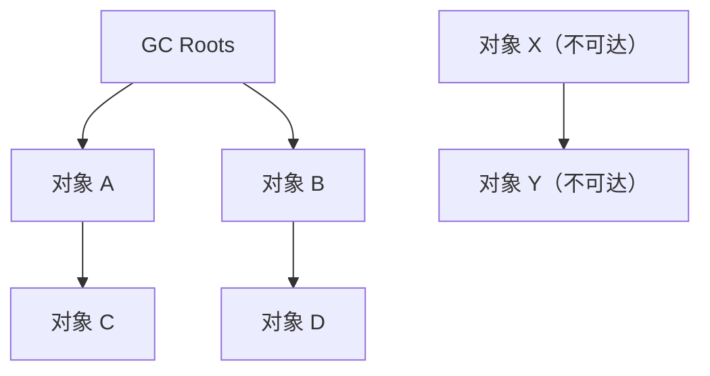
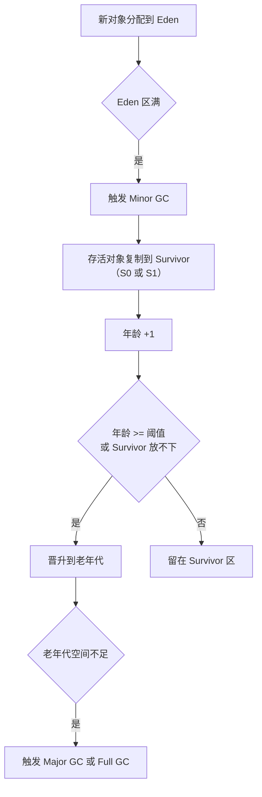

# 垃圾回收机制

## 面试常见问法

- JVM 怎么判断一个对象是否可以被回收？
- 引用计数法和可达性分析有什么区别？
- GC Roots 有哪些？
- Java 中有几种引用类型？
- 常见的垃圾回收算法有哪些？
- Minor GC、Major GC 和 Full GC 有什么区别？

## 核心回答

JVM 通过可达性分析算法判断对象是否存活。从 GC Roots 出发，沿引用链遍历，不可达的对象被判定为可回收。常见的回收算法有标记-清除、标记-复制和标记-整理。新生代通常使用标记-复制算法（Eden + 两个 Survivor），老年代通常使用标记-清除或标记-整理算法。Minor GC 回收新生代，Major GC 回收老年代，Full GC 回收整个堆和方法区。

## 背景

垃圾回收是 JVM 自动内存管理的核心能力，也是 Java 和 C/C++ 的根本差异之一。后端开发中，GC 直接影响接口响应时间（STW 停顿）、系统吞吐量和内存利用率。线上常见的 Full GC 频繁、Young GC 耗时长、内存泄漏等问题都需要理解 GC 的判定算法和回收算法。面试中通常从可达性分析开始，逐步追问到 GC 算法对比、分代回收策略和触发条件。

## 核心概念

### 可达性分析



> 从 GC Roots 出发，沿引用链向下搜索，所有能被引用链连接到的对象都是存活的。GC Roots 到不了的对象即为可回收对象。

### GC Roots 包括

1. **虚拟机栈中引用的对象**：当前执行方法的局部变量和参数引用的对象。
2. **方法区中类静态属性引用的对象**：`static` 字段引用的对象。
3. **方法区中常量引用的对象**：`static final` 常量引用的对象。
4. **本地方法栈中 JNI 引用的对象**：Native 方法持有的引用。
5. **被 synchronized 锁持有的对象**。
6. **JVM 内部的引用**：如基本类型对应的 `Class` 对象、系统类加载器等。

### 三种回收算法对比

| 算法 | 过程 | 优点 | 缺点 | 适用代 |
|---|---|---|---|---|
| 标记-清除 | 标记可回收对象后直接清除 | 实现简单 | 产生内存碎片 | 老年代（CMS） |
| 标记-复制 | 将存活对象复制到另一块空间 | 无碎片，分配快 | 浪费一半空间（Survivor 优化后浪费 10%） | 新生代 |
| 标记-整理 | 标记后将存活对象向一端压缩 | 无碎片 | 移动对象开销大 | 老年代 |

### 分代回收流程



## 项目结合

通过 GC 日志分析回收效率，是线上调优的基础操作。

```bash
# 开启 GC 日志（JDK 8）
java -Xmx512m -Xms512m \
     -XX:+PrintGCDetails \
     -XX:+PrintGCDateStamps \
     -XX:+PrintGCTimeStamps \
     -Xloggc:/var/log/app-gc.log \
     -jar app.jar

# 开启 GC 日志（JDK 11+，统一日志框架）
java -Xmx512m -Xms512m \
     -Xlog:gc*:file=/var/log/app-gc.log:time,uptime,level,tags \
     -jar app.jar
```

```java
/**
 * 通过弱引用判断对象是否被 GC 回收，常用于缓存和监控场景
 */
public class WeakReferenceDemo {
    public static void main(String[] args) {
        Object strongRef = new Object();
        WeakReference<Object> weakRef = new WeakReference<>(strongRef);

        System.out.println("GC 前: " + weakRef.get()); // 非 null

        // 断开强引用，只剩弱引用
        strongRef = null;
        System.gc();

        // GC 后弱引用指向的对象被回收
        System.out.println("GC 后: " + weakRef.get()); // null
    }
}
```

## 深入追问

- **为什么不用引用计数法？** 引用计数法给每个对象维护一个计数器，被引用时加一，引用失效时减一，计数为零时回收。它的致命缺陷是无法处理循环引用——A 引用 B，B 引用 A，两者的计数都不为零但都已不可达。Python 使用引用计数作为主要 GC 策略，但需要额外的循环检测机制。JVM（HotSpot）选择了可达性分析。

- **finalize 方法还有用吗？** 对象被可达性分析判定为不可达后，如果重写了 `finalize()`，会被放入 `F-Queue` 等待 Finalizer 线程执行。`finalize()` 中可以重新建立引用（自我拯救），但只有一次机会。实际开发中强烈不推荐使用 `finalize()`，因为执行时机不确定、可能延迟回收、且有性能开销。JDK 9 已将其标记为 `@Deprecated`。应使用 `try-with-resources` 或 `Cleaner` 替代。

- **四种引用类型分别是什么？** 强引用（`new Object()`）不会被回收；软引用（`SoftReference`）在内存不足时被回收，适合缓存；弱引用（`WeakReference`）在下次 GC 时被回收，`ThreadLocalMap` 的 key 使用弱引用；虚引用（`PhantomReference`）无法通过它获取对象，配合 `ReferenceQueue` 用于追踪对象回收时机，NIO 的 `DirectByteBuffer` 用它触发堆外内存释放。

- **Minor GC 和 Full GC 的触发条件？** Minor GC 在 Eden 区满时触发。Full GC 的触发条件包括：老年代空间不足、方法区/元空间不足、显式调用 `System.gc()`（不保证立即执行）、CMS GC 并发阶段失败（Concurrent Mode Failure）、Minor GC 前的空间担保检查失败。

- **什么是空间担保？** Minor GC 前，JVM 需要评估老年代是否能容纳本次新生代 GC 后可能晋升的对象。如果老年代剩余空间不足，就可能提前触发 Full GC 或出现晋升失败。早期 HotSpot 资料中常提到 `HandlePromotionFailure`，但这是偏 JDK 6/7 的讨论点，现代面试更建议说明“晋升空间不足会导致更重的回收或失败”，不要把旧参数当作通用结论。

- **什么是 STW（Stop The World）？** GC 过程中，JVM 会暂停所有用户线程，称为 STW。标记阶段需要保证对象引用关系的一致性，如果不暂停用户线程，引用关系可能在标记过程中发生变化。不同收集器的目标就是减少 STW 的时长和频率。

## 常见问题

- **不要说"没有引用的对象就会被回收"**：应该说"从 GC Roots 不可达的对象才会被回收"。即使没有局部变量引用，如果对象被静态字段、常量或其他存活对象间接引用，它仍然不会被回收。
- **不要混淆 Minor GC 和 Full GC 的范围**：Minor GC 只回收新生代；Full GC 回收整个堆（新生代 + 老年代）和方法区。面试时要分清。
- **不要忽略 `System.gc()` 的不确定性**：`System.gc()` 只是建议 JVM 执行 GC，不保证立即执行。生产环境通常通过 `-XX:+DisableExplicitGC` 禁止显式 GC 调用，避免不必要的 Full GC。
- **不要认为 GC 就是回收堆内存**：元空间中不再被引用的类信息也会被回收（需要满足条件：该类的所有实例已被回收、加载该类的 ClassLoader 已被回收、该类对应的 Class 对象没有被引用）。

## 线上案例

**大对象直接进入老年代导致频繁 Full GC**：某报表服务每次查询返回数万条记录，拼装成一个超大的 `List<ReportDTO>`，对象生命周期跨过多次 Young GC 后快速晋升到老年代。高 QPS 下老年代快速填满，Full GC 频繁触发，STW 导致接口 P99 飙升到数秒。排查时通过 GC 日志发现 Full GC 间隔只有几十秒，`jmap -histo` 显示大量 `ReportDTO` 对象在老年代。修复方案：一是优化查询，增加分页或流式处理，限制单次返回数据量；二是结合所用收集器调整新生代大小或 G1 停顿目标；三是增加 GC 日志监控和 Full GC 频率告警。`-XX:PretenureSizeThreshold` 只对部分收集器有效，不应作为 G1 场景的通用方案。

## 相关笔记

- [JVM内存区域](./01-JVM内存区域.md)：分代回收的前提是理解堆的新生代/老年代划分。
- [垃圾收集器](./03-垃圾收集器.md)：不同收集器对回收算法和 STW 策略的具体实现。
- [对象创建与内存布局](./05-对象创建与内存布局.md)：对象如何在 Eden 区分配和 TLAB 优化。
- [JVM调优实践](./06-JVM调优实践.md)：GC 日志分析和调优参数的实际应用。

## 一句话总结

JVM 垃圾回收的面试核心是可达性分析（GC Roots）、三种回收算法的对比与适用场景（标记-复制/清除/整理）、分代回收策略（Eden → Survivor → 老年代）和 GC 触发条件。
