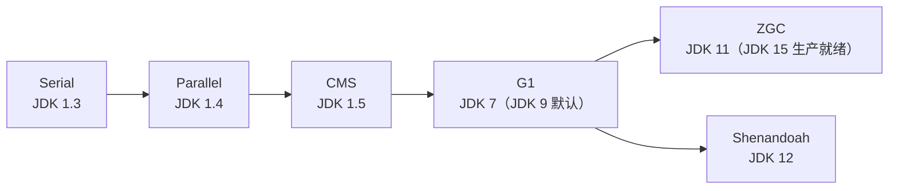
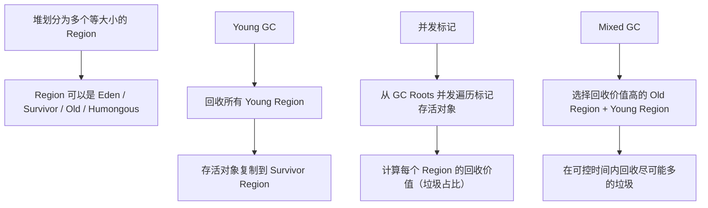

# 垃圾收集器

## 面试常见问法

- JVM 有哪些垃圾收集器？
- CMS 和 G1 有什么区别？
- G1 的工作原理是什么？
- 什么是 ZGC？它解决了什么问题？
- 生产环境怎么选择垃圾收集器？

## 核心回答

JVM 提供了多种垃圾收集器，核心的有 Serial、Parallel、CMS、G1 和 ZGC。Serial 是单线程收集器；Parallel 是多线程吞吐量优先收集器；CMS 是以低停顿为目标的并发收集器，但有内存碎片问题；G1 是分区式收集器，兼顾吞吐量和停顿时间，JDK 9 之后是默认收集器；ZGC 是超低延迟收集器，停顿时间控制在毫秒级。生产环境中，大多数 Java 后端服务使用 G1，对延迟极度敏感的场景考虑 ZGC。

## 背景

垃圾收集器的选择直接影响 Java 后端服务的响应时间和吞吐量。CMS 曾经是低延迟场景的主流选择，但在 JDK 9 中被标记为废弃，JDK 14 中被移除。G1 从 JDK 9 开始成为默认收集器，适用于大多数后端服务。ZGC 和 Shenandoah 是新一代超低延迟收集器，适合对停顿敏感的金融、游戏等场景。面试中收集器选择和对比是高频考点，面试官通常从 CMS vs G1 切入，追问到 G1 的 Region 模型、Mixed GC 和 ZGC 的着色指针。

## 核心概念

### 收集器演进时间线



### 收集器对比

| 收集器 | 算法 | 线程模型 | 目标 | STW 特点 | 适用场景 |
|---|---|---|---|---|---|
| Serial | 新生代复制、老年代整理 | 单线程 | 简单可靠 | 全程 STW | 客户端、小堆 |
| Parallel（Throughput） | 新生代复制、老年代整理 | 多线程 | 吞吐量优先 | 全程 STW，但并行处理 | 批处理、后台计算 |
| CMS | 老年代标记-清除 | 并发标记、并发清除 | 低停顿 | 初始标记和重新标记 STW | JDK 8 低延迟（已废弃） |
| G1 | Region 分区、整体标记-整理 | 并发标记、增量回收 | 可控停顿 | 初始标记和最终标记短暂 STW | **通用推荐** |
| ZGC | Region 分区、着色指针 | 几乎全并发 | 超低延迟 | 目标是极短停顿，通常可控制在毫秒级 | 大堆、低延迟 |

### G1 收集器工作原理



> G1 的核心设计思想是"Garbage First"——优先回收垃圾最多的 Region。通过 `-XX:MaxGCPauseMillis` 设置期望停顿时间（默认 200ms），G1 会根据历史数据估算回收每个 Region 的耗时，选择在目标时间内能回收最多垃圾的 Region 集合。

## 项目结合

生产环境中切换 G1 收集器并配置参数：

```bash
# JDK 8 显式启用 G1（JDK 9+ 默认 G1）
java -Xmx4g -Xms4g \
     -XX:+UseG1GC \
     -XX:MaxGCPauseMillis=200 \
     -XX:G1HeapRegionSize=8m \
     -XX:InitiatingHeapOccupancyPercent=45 \
     -XX:+PrintGCDetails \
     -XX:+PrintGCDateStamps \
     -Xloggc:/var/log/app-gc.log \
     -jar app.jar
```

```bash
# JDK 17 启用 ZGC
java -Xmx4g -Xms4g \
     -XX:+UseZGC \
     -Xlog:gc*:file=/var/log/app-gc.log:time,uptime,level,tags \
     -jar app.jar
```

```java
/**
 * 大对象分配示例
 * G1 中超过 Region 大小一半的对象会分配到 Humongous Region
 * 频繁分配大对象可能导致 Full GC
 */
public class HumongousObjectDemo {
    public static void main(String[] args) {
        // 假设 Region 大小为 2MB，超过 1MB 的对象进入 Humongous Region
        // 大量分配会导致 Humongous Region 碎片化
        for (int i = 0; i < 1000; i++) {
            byte[] bigArray = new byte[1024 * 1024 * 2]; // 2MB 大对象
        }
    }
}
```

## 深入追问

- **CMS 为什么被废弃？** CMS 使用标记-清除算法，长期运行后会产生大量内存碎片，可能导致 Full GC 时无法找到连续空间分配大对象，触发 Serial Old 兜底（单线程整理，停顿时间极长）。此外 CMS 存在 Concurrent Mode Failure（并发标记阶段老年代空间不足）和浮动垃圾问题（并发阶段产生的新垃圾无法在本次回收）。G1 在设计上解决了这些问题。

- **G1 的 Region 模型有什么优势？** 传统分代收集器将堆物理上划分为新生代和老年代，大小相对固定。G1 将堆划分为多个等大小的 Region，Region 大小通常在 1MB 到 32MB 之间，JVM 会根据堆大小选择合适的 Region 大小，目标大致让 Region 数量处在约 2048 个量级。每个 Region 可以动态充当 Eden、Survivor、Old 或 Humongous 角色，这种灵活性使得 G1 能根据运行时的回收收益动态选择回收集合。

- **什么是 Humongous Region？** 大小超过一个 Region 的 50% 的对象被称为大对象（Humongous Object），会被分配到专门的 Humongous Region。Humongous Region 可以跨多个连续 Region。频繁分配大对象会导致 Humongous Region 碎片化，可能触发 Full GC。应避免在高频路径上分配大数组或大对象。

- **G1 的 Mixed GC 和 Young GC 有什么区别？** Young GC 只回收 Young Region（Eden + Survivor）。Mixed GC 在并发标记完成后触发，同时回收 Young Region 和部分回收价值高的 Old Region。G1 通过 Mixed GC 渐进式回收老年代，避免了 Full GC 的长停顿。如果 Mixed GC 回收速度跟不上对象分配速度，最终仍会退化为 Full GC（单线程，JDK 10 之前；JDK 10 之后为并行 Full GC）。

- **ZGC 的着色指针是什么？** ZGC 将 GC 信息编码在对象指针中（利用 64 位指针中未使用的高位），而不是在对象头或额外的数据结构中。这使得 ZGC 可以和读屏障配合，在应用线程运行时并发完成标记和重定位。ZGC 的目标是让停顿时间主要与 GC Roots 数量相关，而不是随堆大小线性增长；实际停顿受 JDK 版本、堆大小、对象分配速率和运行环境影响，面试时不要绝对化说“必然小于某个固定值”。

- **什么是记忆集（Remembered Set）和卡表（Card Table）？** 分代收集时，老年代对象可能引用新生代对象。Minor GC 时如果要扫描整个老年代来找出这些跨代引用，效率极低。卡表将老年代划分为多个"卡页"（512 字节），如果卡页中有对象引用了新生代，就将该卡页标记为"脏"。Minor GC 时只需扫描脏卡页。G1 中每个 Region 有自己的 Remembered Set，记录其他 Region 中指向本 Region 的引用。

## 常见问题

- **不要说 CMS 是默认收集器**：JDK 8 的默认收集器是 Parallel（Throughput），JDK 9 之后默认是 G1。CMS 从 JDK 9 开始被废弃，JDK 14 中被移除。
- **不要设置过小的 `MaxGCPauseMillis`**：G1 会为了满足停顿目标而减少每次回收的 Region 数量，导致垃圾回收速度跟不上分配速度，最终触发 Full GC，效果反而更差。200ms 是合理的起点。
- **不要混淆并行和并发**：并行（Parallel）是多个 GC 线程同时工作但用户线程暂停；并发（Concurrent）是 GC 线程和用户线程同时运行。CMS 和 G1 的并发标记阶段用户线程不暂停。
- **G1 不要手动设置新生代大小**：G1 会根据停顿目标自动调整新生代大小。手动设置 `-Xmn` 或 `-XX:NewRatio` 会覆盖 G1 的自适应策略，通常适得其反。

## 线上案例

**CMS Concurrent Mode Failure 导致长时间停顿**：某电商服务使用 CMS 收集器，JDK 8，堆大小 4GB。大促期间对象分配速率暴增，CMS 并发标记阶段还未完成，老年代已经不足以容纳新晋升的对象，触发 Concurrent Mode Failure。JVM 退化为 Serial Old 进行全堆整理，STW 超过 10 秒，大量请求超时。GC 日志显示 `concurrent mode failure` 后紧跟 `Full GC (Allocation Failure)`。修复方案：升级到 G1 收集器，设置 `-XX:MaxGCPauseMillis=200`，同时将 `-XX:InitiatingHeapOccupancyPercent` 从默认 92 调低到 45，让 Mixed GC 更早开始回收老年代。切换后 Full GC 消失，P99 从 10 秒降到 200ms 以内。

## 相关笔记

- [垃圾回收机制](./02-垃圾回收机制.md)：收集器是回收算法的具体实现，需要先理解标记-复制/清除/整理算法。
- [JVM内存区域](./01-JVM内存区域.md)：理解堆的分代结构是学习各收集器回收策略的基础。
- [JVM调优实践](./06-JVM调优实践.md)：收集器的参数配置和 GC 日志分析的实际应用。

## 一句话总结

垃圾收集器的面试核心是 CMS 与 G1 的对比（碎片/Region/可控停顿）、G1 的 Region 模型与 Mixed GC 机制、ZGC 的着色指针与亚毫秒停顿，以及生产环境的选型依据。
