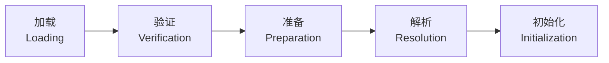
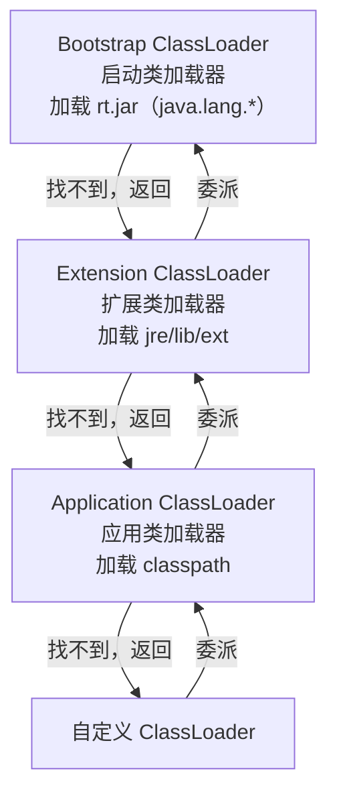

# 类加载机制

## 面试常见问法

- Java 类加载的过程是什么？
- 什么是双亲委派模型？为什么需要它？
- 怎么打破双亲委派模型？
- 类加载器有哪些？
- 什么时候会触发类的初始化？

## 核心回答

Java 类加载过程分为加载、验证、准备、解析和初始化五个阶段。类加载器采用双亲委派模型，加载类时先委托父加载器，父加载器无法加载时才自己加载，保证了核心类库的安全性和类的唯一性。JDK 8 中常见类加载器是 Bootstrap、Extension 和 Application；JDK 9 模块化后 Extension 被 Platform ClassLoader 替代，`rt.jar` 也被模块系统取代。可以通过自定义类加载器和线程上下文类加载器打破双亲委派。

## 背景

类加载机制是 JVM 运行 Java 程序的基础。后端开发中，热部署、SPI 机制、OSGi 模块化、Tomcat 多 Web 应用隔离、动态代理和字节码增强等场景都涉及类加载。线上常见的 `ClassNotFoundException`、`NoClassDefFoundError`、类加载冲突（不同 ClassLoader 加载同一个类导致 ClassCastException）等问题都需要理解类加载的流程和委派模型。面试中类加载通常从五个阶段开始，追问到双亲委派的设计目的和打破方式。

## 核心概念

### 类加载过程



| 阶段 | 说明 |
|---|---|
| 加载 | 通过类的全限定名获取字节码，在元空间保存类元数据，并在堆中创建对应的 `java.lang.Class` 对象 |
| 验证 | 校验字节码格式、语义、字节码指令和符号引用的合法性 |
| 准备 | 为类的静态变量分配内存并设置零值（`static int a` → 0），`static final` 常量在此阶段直接赋值 |
| 解析 | 将常量池中的符号引用转换为直接引用（内存地址） |
| 初始化 | 执行类构造器 `<clinit>`，即静态变量赋值语句和 `static {}` 代码块 |

### 双亲委派模型



> 核心逻辑：收到类加载请求后，先委派给父加载器处理。父加载器还有父加载器则继续向上委派，直到 Bootstrap ClassLoader。如果父加载器无法加载（在其搜索范围内找不到），才由当前加载器尝试加载。

### JDK 8 与 JDK 9+ 的差异

| 版本 | 类加载器结构 | 说明 |
|---|---|---|
| JDK 8 | Bootstrap / Extension / Application | Bootstrap 加载核心类库，Extension 加载 `jre/lib/ext`，Application 加载 classpath |
| JDK 9+ | Bootstrap / Platform / Application | 模块化后移除 Extension，核心类库不再以 `rt.jar` 形式存在，Platform 加载部分平台模块 |

面试时如果对方使用 JDK 17 作为生产版本，回答类加载器时要主动补充 JDK 9+ 的变化。

## 项目结合

通过自定义类加载器实现热加载：

```java
/**
 * 简单的热加载类加载器
 * 每次加载都从文件系统读取最新的字节码，不使用缓存
 */
public class HotSwapClassLoader extends ClassLoader {
    private final String classDir;

    public HotSwapClassLoader(String classDir, ClassLoader parent) {
        super(parent);
        this.classDir = classDir;
    }

    @Override
    protected Class<?> findClass(String name) throws ClassNotFoundException {
        // 将类名转换为文件路径
        String fileName = classDir + "/" + name.replace('.', '/') + ".class";
        try {
            byte[] classData = Files.readAllBytes(Paths.get(fileName));
            // 调用 defineClass 将字节码转换为 Class 对象
            return defineClass(name, classData, 0, classData.length);
        } catch (IOException e) {
            throw new ClassNotFoundException("无法加载类: " + name, e);
        }
    }
}
```

SPI 场景中使用线程上下文类加载器：

```java
/**
 * JDBC 驱动加载是 SPI 打破双亲委派的典型案例
 * DriverManager 在 rt.jar 中（由 Bootstrap 加载），
 * 但具体驱动实现（如 MySQL Driver）在 classpath 中（由 Application 加载），
 * Bootstrap 无法加载 classpath 中的类，所以需要通过线程上下文类加载器"向下委派"
 */
public class SPIDemo {
    public static void main(String[] args) {
        // ServiceLoader 内部使用 Thread.currentThread().getContextClassLoader()
        // 获取 Application ClassLoader 来加载 SPI 实现类
        ServiceLoader<Driver> drivers = ServiceLoader.load(Driver.class);
        for (Driver driver : drivers) {
            System.out.println("加载到驱动: " + driver.getClass().getName());
        }
    }
}
```

## 深入追问

- **为什么需要双亲委派？** 两个核心目的：一是安全性，防止用户自定义一个 `java.lang.String` 类替换核心库；二是避免类重复加载，保证同一个类在 JVM 中只有一个 `Class` 对象（同一个类加载器加载的同一个类才被认为是同一个类型）。

- **怎么打破双亲委派？** 三种方式：（1）重写 `loadClass` 方法，不先委派给父加载器（不推荐）；（2）线程上下文类加载器（`Thread.setContextClassLoader`），SPI 场景使用，让 Bootstrap 加载的代码能通过上下文类加载器委托 Application ClassLoader 加载实现类；（3）OSGi 模块化，每个 Bundle 有自己的类加载器，按模块依赖图加载，不是简单的父子关系。

- **Tomcat 为什么要自定义类加载器？** Tomcat 需要支持多个 Web 应用部署在同一个 JVM 中，每个应用可能使用不同版本的同一个库（如不同版本的 Spring）。Tomcat 为每个 Web 应用创建独立的 `WebappClassLoader`，优先加载 `WEB-INF/lib` 和 `WEB-INF/classes` 中的类（打破双亲委派），实现应用间的类隔离。但 `java.*` 等核心类仍然委派给父加载器。

- **触发类初始化的时机？** （1）`new` 创建实例、读写静态字段（非 `final` 常量）、调用静态方法；（2）反射调用（`Class.forName`）；（3）子类初始化时先初始化父类；（4）JVM 启动时的主类。注意：通过子类引用父类的静态字段不会触发子类初始化；`Class.forName` 默认触发初始化，`ClassLoader.loadClass` 不触发初始化。

- **`ClassNotFoundException` 和 `NoClassDefFoundError` 的区别？** `ClassNotFoundException` 是受检异常，通常发生在 `Class.forName` 或 `ClassLoader.loadClass` 时找不到类。`NoClassDefFoundError` 是 Error，发生在编译时存在但运行时找不到类（如类初始化阶段抛出异常后被标记为不可用，后续再使用时抛出此错误）。

## 常见问题

- **不要说类加载只有三个阶段**：完整的过程是加载、验证、准备、解析、初始化五个阶段。其中验证、准备、解析统称为连接（Linking）。
- **不要混淆"准备"和"初始化"阶段的赋值**：准备阶段只是分配内存和设置零值（`static int a = 10` 在准备阶段 `a = 0`），真正赋值为 10 是在初始化阶段。但 `static final int a = 10` 这种编译期常量在准备阶段就会被赋为 10。
- **不要认为双亲委派不能打破**：SPI、Tomcat、OSGi 等场景都打破了双亲委派，这是合理的设计选择。
- **不要忽略类加载器的命名空间隔离**：不同类加载器加载同一个 `com.example.User` 类，会得到两个不同的 `Class` 对象，它们的实例互相不能类型转换（`ClassCastException`）。

## 线上案例

**类加载冲突导致 ClassCastException**：某微服务引入了两个不同版本的 JSON 库，一个通过 Maven 直接依赖，一个被某个 SDK 间接依赖。两个版本的 `JSONObject` 类全限定名相同但内部结构不同。由于 Maven 的 "nearest wins" 策略，编译时使用了一个版本，运行时 ClassLoader 先加载了另一个版本（依赖顺序导致），SDK 内部创建的 `JSONObject` 在业务代码中使用时抛出 `ClassCastException` 或 `NoSuchMethodError`。排查方式是通过 `-verbose:class` 参数查看类的实际加载路径，或使用 `ClassLoader.getResource("com/alibaba/fastjson/JSONObject.class")` 定位加载源。修复方案是通过 Maven `<exclusions>` 统一版本，或使用 `maven-shade-plugin` 重定位包名。

## 相关笔记

- [JVM内存区域](./01-JVM内存区域.md)：类信息存储在方法区/元空间，理解存储位置是基础。
- [JVM调优实践](./06-JVM调优实践.md)：类加载相关的排查工具和参数（`-verbose:class`、`-XX:+TraceClassLoading`）。

## 一句话总结

类加载机制的面试核心是五个阶段（加载→验证→准备→解析→初始化）、双亲委派模型的设计目的（安全性 + 唯一性）、以及打破双亲委派的三种方式（重写 loadClass、线程上下文类加载器、OSGi）。
