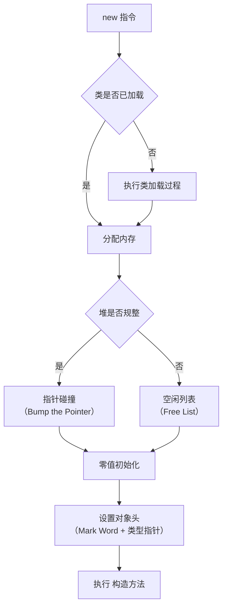
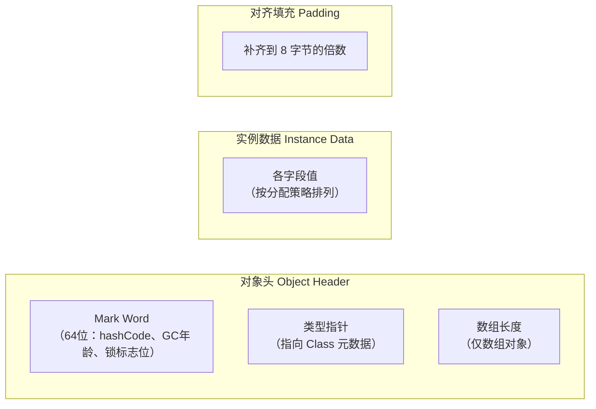

# 对象创建与内存布局

## 面试常见问法

- `new` 一个对象的过程是什么？
- 对象在内存中的布局是怎样的？
- 对象头里有什么？
- 什么是 TLAB？
- 对象怎么定位访问？

## 核心回答

`new` 一个对象的完整流程包括类加载检查、内存分配、零值初始化、设置对象头和执行构造方法。对象在内存中分为对象头、实例数据和对齐填充三部分。对象头包含 Mark Word（存储哈希码、GC 年龄、锁状态）和类型指针（指向 Class 元数据）。内存分配时，为避免多线程竞争，每个线程使用独立的 TLAB（Thread Local Allocation Buffer）。对象访问方式有句柄和直接指针两种，HotSpot 使用直接指针。

## 背景

理解对象创建过程和内存布局，是深入分析 JVM 内存使用、锁实现（[synchronized](../集合与并发/07-synchronized.md) 的 Mark Word）、GC 年龄晋升和内存对齐开销的基础。后端开发中，大量小对象的频繁创建和回收是 Young GC 的主要来源，对象大小的估算影响缓存设计和容量规划。面试中这个知识点经常和锁升级、GC 年龄阈值一起考察。

## 核心概念

### 对象创建流程



### 对象内存布局



### Mark Word 结构（64 位 JVM）

以下内容主要用于理解 HotSpot 的对象头和锁状态。偏向锁是 JDK 8 面试中的高频点，但 JDK 15 后默认禁用，后续版本逐渐淡出主流调优场景，回答时要主动说明版本边界。

| 锁状态 | 存储内容 | 标志位 |
|---|---|---|
| 无锁 | hashCode（31位）、GC 年龄（4位）、偏向模式（1位） | 01 |
| 偏向锁 | 偏向线程 ID（54位）、Epoch（2位）、GC 年龄（4位） | 01 |
| 轻量级锁 | 指向栈中锁记录的指针（62位） | 00 |
| 重量级锁 | 指向 Monitor 对象的指针（62位） | 10 |
| GC 标记 | 空 | 11 |

## 项目结合

估算对象大小有助于缓存容量规划：

```java
/**
 * 使用 JOL（Java Object Layout）分析对象内存布局
 * 依赖：org.openjdk.jol:jol-core
 */
public class ObjectLayoutDemo {
    public static void main(String[] args) {
        // 打印对象的内存布局详情
        System.out.println(ClassLayout.parseInstance(new Object()).toPrintable());
        System.out.println(ClassLayout.parseInstance(new long[0]).toPrintable());
        System.out.println(ClassLayout.parseInstance(new UserDTO()).toPrintable());
    }
}

/**
 * 典型的业务对象
 * 对象头 12 字节 + long 8 字节 + int 4 字节 + 引用 4 字节 + padding = 32 字节
 */
class UserDTO {
    private long userId;        // 8 字节
    private int age;            // 4 字节
    private String name;        // 4 字节（压缩指针）
}
```

TLAB 对高并发对象分配的影响：

```java
/**
 * TLAB 示例说明
 * 每个线程有独立的 Eden 区分配缓冲区，避免多线程分配对象时的锁竞争
 * 可通过 -XX:+PrintTLAB 查看 TLAB 使用情况
 * TLAB 大小可通过 -XX:TLABSize 调整，但通常让 JVM 自适应
 */
public class TLABDemo {
    public static void main(String[] args) {
        // 高并发场景下，每个线程在自己的 TLAB 中分配对象
        // 不需要同步，分配效率接近栈上分配
        for (int i = 0; i < 1000000; i++) {
            // 小对象优先在 TLAB 中分配
            Object obj = new Object();
        }
    }
}
```

## 深入追问

- **指针碰撞和空闲列表的区别？** 如果堆内存规整（所有用过的内存在一边，空闲内存在另一边），使用指针碰撞——移动分界指针即可分配。如果堆内存不规整（已用和空闲内存交错），使用空闲列表——维护一个记录可用内存块的列表。使用哪种方式取决于垃圾收集器是否带有压缩整理能力：Serial、Parallel 使用指针碰撞；CMS 基于标记-清除，使用空闲列表。

- **TLAB 的作用和原理？** TLAB（Thread Local Allocation Buffer）是 Eden 区中为每个线程预分配的一小块内存。线程分配对象时直接在自己的 TLAB 中通过指针碰撞分配，不需要同步。TLAB 用完后再从 Eden 区申请新的 TLAB（需要 CAS 同步）。TLAB 默认开启（`-XX:+UseTLAB`），大小由 JVM 自适应调整，通常占 Eden 区的 1%。TLAB 中分配不下的大对象直接在 Eden 区的共享区域分配。

- **什么是逃逸分析和栈上分配？** JIT 编译器通过逃逸分析判断对象是否会逃出方法范围。如果对象不逃逸（只在方法内部使用），可以进行栈上分配（对象在栈帧中分配，方法返回时自动回收，无需 GC）、标量替换（将对象拆解为基本类型变量）和同步消除（去掉不必要的锁）。开启逃逸分析：`-XX:+DoEscapeAnalysis`（JDK 8 默认开启）。注意：HotSpot 实际上通过标量替换实现类似效果，而不是真正的栈上分配。

- **对象怎么定位访问？** 两种方式：（1）句柄访问——堆中维护句柄池，引用指向句柄，句柄包含对象地址和类型信息地址。优点是对象移动时只需更新句柄。（2）直接指针——引用直接指向对象，对象头中包含类型指针。优点是少一次间接寻址，访问更快。HotSpot 使用直接指针。

- **什么是指针压缩？** 64 位 JVM 中，对象引用占 8 字节。开启压缩指针（`-XX:+UseCompressedOops`，堆 < 32GB 时默认开启），引用压缩为 4 字节，通过偏移量计算真实地址。这可以减少约 40% 的内存占用。但堆大小超过 32GB 时指针压缩自动失效，引用恢复为 8 字节，所以堆大小从 31GB 跳到 33GB 时实际可用内存可能反而减少。

## 常见问题

- **不要说 `new` 就是分配内存**：`new` 指令的完整过程包括类加载检查、内存分配、零值初始化、对象头设置和构造方法执行。面试时要分步描述。
- **不要忽略对齐填充的内存开销**：HotSpot 要求对象大小必须是 8 字节的倍数。一个只有一个 `boolean` 字段的对象，对象头 12 字节 + boolean 1 字节 + padding 3 字节 = 16 字节。大量小对象的对齐填充开销不可忽视。
- **不要混淆 `<init>` 和 `<clinit>`**：`<init>` 是实例构造方法（每次 `new` 都执行），`<clinit>` 是类构造器（类初始化时执行一次，由静态变量赋值和 `static {}` 块合并生成）。
- **不要忽略 TLAB 对性能的影响**：关闭 TLAB 后，多线程高频分配对象会产生严重的 CAS 竞争，分配速度可能下降数倍。

## 线上案例

**大量小对象导致 Young GC 频繁**：某接口聚合服务每次请求创建大量临时 DTO 对象进行数据转换（每个请求约创建 500 个小对象）。高 QPS 下 Eden 区快速填满，Young GC 频率达到每秒 2-3 次，虽然单次耗时短（10ms），但累计 STW 时间影响了 P99 延迟。排查时通过 `-XX:+PrintGCDetails` 发现 Young GC 间隔不到 500ms。优化方案：（1）分页或流式处理，避免一次性创建超大中间集合；（2）减少无意义的对象转换和临时包装对象；（3）结合收集器调整新生代大小或 G1 停顿目标；（4）确认逃逸分析和标量替换是否生效。普通 DTO 不建议默认对象池化，对象池更适合连接、线程、Buffer 等创建成本高或受外部资源约束的对象。

## 相关笔记

- [JVM内存区域](./01-JVM内存区域.md)：对象分配在堆的 Eden 区，理解分代结构是基础。
- [垃圾回收机制](./02-垃圾回收机制.md)：对象的 GC 年龄存储在 Mark Word 中，影响晋升策略。
- [synchronized](../集合与并发/07-synchronized.md)：锁状态信息存储在对象头的 Mark Word 中，理解对象头结构才能理解锁升级。
- [类加载机制](./04-类加载机制.md)：对象创建的第一步是类加载检查。

## 一句话总结

对象创建的面试核心是完整的创建流程（类检查→分配→零值→对象头→构造）、内存布局三部分（对象头/实例数据/对齐填充）、Mark Word 的多态结构、以及 TLAB 和逃逸分析对分配效率的优化。
