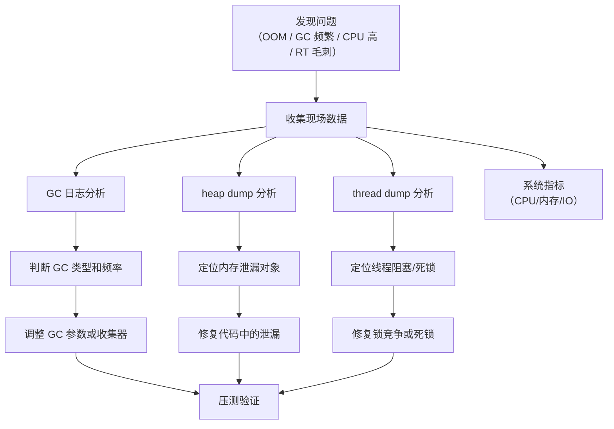

# JVM 调优实践

## 面试常见问法

- 线上遇到 OOM 怎么排查？
- Full GC 频繁怎么处理？
- 常用的 JVM 调优参数有哪些？
- 怎么分析 GC 日志？
- 线上 CPU 100% 怎么排查？
- 有没有做过 JVM 调优？说说具体案例。

## 核心回答

JVM 调优的核心是确定问题、收集数据、分析原因、调整参数和验证效果。常用排查工具包括 `jps`、`jstat`、`jmap`、`jstack`、`jinfo` 和 Arthas。调优参数主要围绕堆大小（`-Xmx`/`-Xms`）、新生代比例（`-XX:NewRatio`）、GC 收集器选择（`-XX:+UseG1GC`）和 GC 日志开启。调优不是改参数碰运气，而是基于 GC 日志和 heap dump 做数据驱动的分析。

## 背景

JVM 调优是 Java 后端工程师的核心能力之一。线上系统的 OOM、Full GC 频繁、接口响应毛刺、CPU 飙升等问题都可能和 JVM 相关。面试中通常不只问理论，而是考察实际排查经验：你遇到过什么问题、用什么工具、怎么定位、怎么修复。这个知识点把前面内存区域、GC 机制、收集器等理论串联成实际的排查和调优流程。

## 核心概念

### 排查流程



### 常用 JVM 参数速查

| 参数 | 说明 | 推荐值 |
|---|---|---|
| `-Xmx` / `-Xms` | 最大/初始堆大小 | 设为相同值，避免动态扩缩 |
| `-XX:+UseG1GC` | 使用 G1 收集器 | JDK 8 显式开启，JDK 9+ 默认 |
| `-XX:MaxGCPauseMillis` | G1 期望最大停顿时间 | 200ms 起步 |
| `-XX:MaxMetaspaceSize` | 元空间最大值 | 256m-512m，必须设置上限 |
| `-XX:+HeapDumpOnOutOfMemoryError` | OOM 时自动生成 heap dump | **生产必开** |
| `-XX:HeapDumpPath` | heap dump 路径 | 指定到有足够空间的目录 |
| `-Xlog:gc*` (JDK 11+) | GC 日志 | **生产必开** |
| `-XX:+PrintGCDetails` (JDK 8) | GC 日志详情 | **生产必开** |
| `-Xss` | 线程栈大小 | 默认 1MB，通常不需要调整 |
| `-XX:MaxDirectMemorySize` | 直接内存上限 | NIO 重度使用时需要设置 |

## 项目结合

### OOM 排查流程

```bash
# 1. 确认 OOM 类型（查看应用日志或 GC 日志）
# java.lang.OutOfMemoryError: Java heap space     → 堆溢出
# java.lang.OutOfMemoryError: Metaspace            → 元空间溢出
# java.lang.OutOfMemoryError: Direct buffer memory → 直接内存溢出

# 2. 获取 heap dump（如果未开启自动 dump）
jmap -dump:format=b,file=/tmp/heapdump.hprof <pid>

# 3. 使用 MAT（Eclipse Memory Analyzer）或 VisualVM 分析
# 重点关注：Dominator Tree（占用最大的对象）、Leak Suspects（泄漏嫌疑）

# 4. 也可以用 jmap 快速查看堆中对象统计
jmap -histo <pid> | head -30
```

### CPU 100% 排查流程

```bash
# 1. 找到 CPU 使用率最高的 Java 进程
top -c

# 2. 找到该进程中 CPU 使用率最高的线程
top -Hp <pid>

# 3. 将线程 ID 转换为 16 进制
printf '%x\n' <tid>

# 4. 生成线程 dump
jstack <pid> > /tmp/thread_dump.txt

# 5. 在 thread dump 中搜索对应线程的 nid
grep -A 30 'nid=0x<hex_tid>' /tmp/thread_dump.txt

# 常见原因：
# - 死循环（业务代码 bug 或正则回溯）
# - 频繁 Full GC（GC 线程占满 CPU）
# - 大量线程自旋等待锁
```

### Full GC 频繁排查

```bash
# 1. 查看 GC 频率和耗时
jstat -gcutil <pid> 1000

# 输出示例：
#   S0     S1     E      O      M     CCS    YGC     YGCT    FGC    FGCT     GCT
#   0.00  45.23  78.12  92.34  95.12  91.23   234    2.345    12    8.901   11.246
# 关注 O（老年代使用率）、FGC（Full GC 次数）、FGCT（Full GC 总耗时）

# 2. 如果老年代使用率持续 > 90%，分析老年代中是什么对象
jmap -histo <pid> | head -30

# 3. 常见原因：
# - 内存泄漏（对象一直被引用，无法回收）
# - 大对象直接进入老年代
# - 新生代太小，对象过早晋升
# - 缓存未设置淘汰策略
```

### Arthas 快速诊断

```bash
# 启动 Arthas
java -jar arthas-boot.jar

# 查看 JVM 信息
dashboard

# 查看线程 CPU 使用排名
thread -n 5

# 查看死锁
thread -b

# 查看方法调用耗时
trace com.example.OrderService createOrder

# 查看方法入参和返回值
watch com.example.OrderService createOrder '{params, returnObj}' -x 2

# 动态修改日志级别（无需重启）
logger --name com.example --level DEBUG

# 反编译运行中的类（确认部署版本）
jad com.example.OrderService
```

## 深入追问

- **怎么判断是内存泄漏还是内存不够？** 如果 Full GC 后老年代使用率能降下来（如从 90% 降到 30%），说明内存回收正常，只是堆不够大。如果 Full GC 后老年代使用率几乎不变（仍然 > 80%），说明存在内存泄漏——有大量对象一直被强引用持有，无法被回收。需要通过 heap dump 定位泄漏对象和引用链。

- **什么时候需要调优？** 不是所有 GC 都需要调优。调优的前提是 GC 已经对业务产生了可观测的影响：Full GC 导致接口超时、Young GC 频率过高导致 CPU 不足、STW 停顿导致 P99 毛刺。如果 GC 表现正常、接口延迟满足 SLA，不需要调优。

- **堆大小怎么设置？** 不是越大越好。堆太大会导致 Full GC 停顿时间更长。一般原则：堆大小为老年代存活对象大小的 3-5 倍。可以在 Full GC 后通过 `jstat` 观察老年代使用量作为基准。例如 Full GC 后老年代稳定在 500MB，堆设为 1.5GB-2.5GB 比较合理。

- **生产环境必须开启的参数？** （1）`-XX:+HeapDumpOnOutOfMemoryError`：OOM 时自动生成 dump，事后分析的唯一机会；（2）GC 日志：JDK 8 用 `-XX:+PrintGCDetails -Xloggc:path`，JDK 11+ 用 `-Xlog:gc*:file=path`；（3）`-XX:MaxMetaspaceSize`：限制元空间，防止无限增长。

- **如何做容量规划？** 通过压测确定单实例的处理能力上限。逐步加压，观察 GC 频率、堆使用率、CPU 使用率和接口 P99。当 GC 频率或 P99 开始明显恶化时，就是该实例的容量上限。线上预留 30% 的余量。

## 常见问题

- **不要在线上随意执行 `jmap -dump`**：`jmap -dump` 会触发 Full GC 并暂停应用，堆越大暂停越久（4GB 堆可能暂停数十秒）。应在流量低峰期执行，或依赖 OOM 时自动生成的 dump。
- **不要盲目增大堆来解决 GC 问题**：堆越大 Full GC 停顿越长。应先分析 GC 日志找到根因（内存泄漏、大对象、晋升过快），对症下药。
- **不要忽略堆外内存**：`jmap` 和 `jstat` 只能看到堆内存。如果进程 RSS 持续增长但堆使用率正常，需要排查直接内存（NIO）、元空间、JNI 分配或线程栈。可以用 `Native Memory Tracking`（`-XX:NativeMemoryTracking=summary`）辅助分析。
- **不要在生产环境关闭 GC 日志**：GC 日志的开销极小（CPU < 1%），但出问题时是最关键的诊断数据。没有 GC 日志就只能靠猜。
- **调优后必须压测验证**：参数修改后要在预发环境进行压测，观察 GC 日志、P99、CPU 等指标确认效果，避免引入新问题。

## 线上案例

### 案例一：HashMap 做本地缓存导致老年代持续增长

某用户服务使用 `HashMap` 缓存用户画像数据，key 是用户 ID，没有设置容量上限和过期策略。随着访问用户增多，HashMap 中的条目持续增长。Full GC 后老年代使用率从 85% 只降到 80%，说明这些缓存对象一直被强引用持有。`jmap -histo` 显示 `HashMap$Node` 占用了大量老年代空间。修复方案：将 HashMap 替换为 Caffeine 本地缓存，设置最大条目数和过期时间。

```java
// 修复前：无淘汰策略的本地缓存
private final Map<Long, UserProfile> cache = new HashMap<>();

// 修复后：使用 Caffeine，限制容量和过期时间
private final Cache<Long, UserProfile> cache = Caffeine.newBuilder()
        .maximumSize(10000)                     // 最大缓存 10000 条
        .expireAfterWrite(Duration.ofMinutes(5)) // 写入 5 分钟后过期
        .build();
```

### 案例二：线程创建过多导致 OOM

某异步通知服务为每个通知任务创建新线程（`new Thread(task).start()`），没有使用线程池。大促期间通知量暴增，短时间内创建了数千个线程。每个线程默认栈大小 1MB，数千个线程占用数 GB 的栈空间，触发 `OutOfMemoryError: unable to create new native thread`。排查时通过 `jstack` 发现数千个线程处于 RUNNABLE 状态。修复方案：使用固定大小的 [ThreadPoolExecutor](../集合与并发/06-线程池-ThreadPoolExecutor.md)，限制最大线程数和队列容量。

### 案例三：正则表达式回溯导致 CPU 100%

某接口使用正则表达式校验用户输入，正则写法存在灾难性回溯（catastrophic backtracking）。恶意用户构造特定输入后，正则匹配的时间复杂度变为指数级，单个请求占满一个 CPU 核。多个此类请求并发后 CPU 100%。排查时通过 `top -Hp` 找到 CPU 最高的线程，`jstack` 定位到正则匹配方法。修复方案：优化正则表达式（消除嵌套量词）、增加输入长度限制、设置正则匹配超时。

## 相关笔记

- [JVM内存区域](./01-JVM内存区域.md)：排查 OOM 的第一步是判断哪个内存区域溢出。
- [垃圾回收机制](./02-垃圾回收机制.md)：理解 GC 触发条件和分代策略是分析 GC 日志的基础。
- [垃圾收集器](./03-垃圾收集器.md)：收集器选择和参数配置是调优的核心手段。
- [对象创建与内存布局](./05-对象创建与内存布局.md)：对象大小估算影响容量规划和 GC 行为分析。
- [线程池 ThreadPoolExecutor](../集合与并发/06-线程池-ThreadPoolExecutor.md)：线程资源管理，避免无限创建线程导致 OOM。

## 一句话总结

JVM 调优的面试核心是排查流程（OOM/Full GC/CPU 高的标准排查步骤）、工具使用（jstat/jmap/jstack/Arthas/MAT）、关键参数（堆大小/GC 日志/HeapDump）和真实案例（内存泄漏/大对象/线程爆炸），本质是数据驱动的问题定位而不是参数调整。
