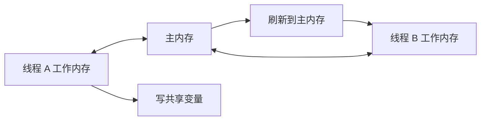

# Java 内存模型 JMM

## 面试常见问法

- 什么是 Java 内存模型？
- `volatile` 为什么能保证可见性？
- happens-before 规则是什么？
- 指令重排序会带来什么问题？
- JMM 和 JVM 内存区域有什么区别？

## 核心回答

JMM 是 Java 语言层面对多线程可见性、原子性和有序性的规范，它描述线程如何通过主内存和工作内存交互。它不是 JVM 运行时数据区，也不是堆、栈这些内存结构。JMM 重点解决的是多线程下变量读写是否可见、操作顺序是否允许重排、同步关系如何建立。面试时要围绕三个关键词回答：可见性、原子性、有序性。

## 核心概念



JMM 规定线程对共享变量的操作需要在工作内存中进行，变量最终存储在主内存中。不同线程之间不能直接访问对方工作内存，必须通过主内存完成可见性传递。

## 项目结合

后台任务停止标记是 `volatile` 的经典场景。

```java
public class ExportTask implements Runnable {
    private volatile boolean running = true;

    public void stop() {
        // 写 volatile 变量后，工作线程能及时看到停止信号
        running = false;
    }

    @Override
    public void run() {
        while (running) {
            // 执行一次导出任务分片，避免单次循环耗时过长导致停止不及时
            exportOneBatch();
        }
    }

    private void exportOneBatch() {
        // 分批处理数据，降低单次任务对内存和响应性的影响
    }
}
```

## 深入追问

- **happens-before 是什么？** 它是 JMM 中判断可见性的规则。如果操作 A happens-before 操作 B，那么 A 的结果对 B 可见，并且 A 的执行顺序排在 B 之前。
- **常见 happens-before 规则有哪些？** 程序顺序规则、监视器锁规则、volatile 变量规则、线程启动规则、线程终止规则、传递性规则。
- **`volatile` 保证什么？** 保证可见性和有序性，不保证复合操作原子性。
- **`synchronized` 保证什么？** 保证互斥、可见性和有序性。线程释放锁前会把修改刷新到主内存，线程获取锁后会读取最新值。
- **JMM 和 JVM 内存区域区别？** JVM 内存区域讲运行时数据如何划分，JMM 讲多线程读写共享变量时的内存语义。

## 常见问题

- 不要把 JMM 说成“堆和栈的划分”。
- 不要说 `volatile` 是轻量级锁，它不提供互斥。
- 不要把“有序性”理解成完全禁止重排序，JMM 只禁止会破坏语义的重排序。

## 一句话总结

JMM 是 Java 多线程的内存语义规范，面试核心是可见性、原子性、有序性、happens-before 和 `volatile` 的边界。
