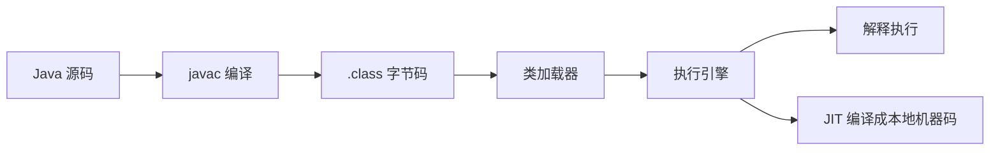

# 字节码与执行引擎

## 面试常见问法

- Java 为什么能跨平台？
- JVM 是怎么执行字节码的？
- 栈帧里有什么？
- 解释执行和编译执行有什么区别？
- 常见字节码指令有哪些？

## 核心回答

Java 源码先编译成平台无关的 `.class` 字节码，再由不同平台上的 JVM 执行，所以能实现“一次编译，到处运行”。JVM 执行字节码时以栈帧为基本单位，每次方法调用都会创建栈帧，栈帧包含局部变量表、操作数栈、动态链接和返回地址。执行方式上，JVM 既可以解释执行字节码，也可以通过 JIT 把热点代码编译成本地机器码。

## 核心概念



### 栈帧结构

| 组成 | 作用 |
|---|---|
| 局部变量表 | 存放方法参数和局部变量 |
| 操作数栈 | 字节码指令的计算工作区 |
| 动态链接 | 支持符号引用到直接引用的转换 |
| 方法返回地址 | 记录方法返回后继续执行的位置 |

## 项目结合

面试中可以用一个简单方法说明操作数栈模型。

```java
public int add(int a, int b) {
    // 编译后大致会经历加载 a、加载 b、执行 iadd、返回结果
    return a + b;
}
```

可以通过 `javap` 查看字节码。

```bash
# 查看类的字节码指令，适合分析语法糖和方法调用
javap -c -v Demo.class
```

## 深入追问

- **为什么字节码有利于跨平台？** 字节码是 JVM 规范定义的中间格式，不绑定具体 CPU 指令集，不同平台 JVM 负责转换和执行。
- **操作数栈有什么用？** JVM 大多数指令基于栈计算，指令把数据压入操作数栈，再从栈中弹出操作数进行计算。
- **动态链接是什么？** Class 文件常量池中保存符号引用，运行期需要解析成直接引用，用于方法调用和字段访问。
- **解释执行和 JIT 的关系？** 解释执行启动快，JIT 编译后运行快。JVM 会根据热点探测决定是否编译成本地机器码。

## 常见问题

- 不要把 JVM 执行理解成只解释执行，现代 HotSpot 是解释执行和 JIT 编译结合。
- 不要忽略栈帧，很多 JVM 问题最终会追到局部变量表、操作数栈和方法调用。
- 不要把 `.class` 文件等同于机器码，它是 JVM 字节码。

## 一句话总结

字节码与执行引擎的面试核心是跨平台原理、栈帧结构、操作数栈模型，以及解释执行和 JIT 编译的协作。
