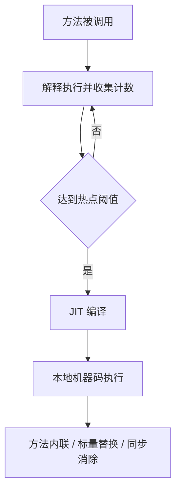

# JIT 编译与逃逸分析

## 面试常见问法

- 什么是 JIT？
- 什么是热点代码？
- 逃逸分析有什么作用？
- 什么是标量替换和同步消除？
- 为什么说 HotSpot 不一定真的做栈上分配？

## 核心回答

JIT 是 Just-In-Time Compiler，即即时编译器。JVM 会先解释执行代码，同时收集方法调用次数、循环次数等运行时数据。当某段代码成为热点后，JIT 会把它编译成本地机器码，提高执行效率。逃逸分析是 JIT 的一种优化手段，用于判断对象是否逃出方法或线程范围。如果对象不逃逸，JIT 可能进行标量替换、同步消除等优化，减少对象分配和锁开销。

## 核心概念



## 项目结合

普通对象如果只在方法内部使用，可能被 JIT 优化掉实际分配。

```java
public long calculateTotal(long userId, long amount) {
    Money money = new Money(amount);
    // money 没有返回，也没有赋给外部对象，可能不会逃逸出当前方法
    return money.value() + userId;
}

class Money {
    private final long amount;

    Money(long amount) {
        // 金额对象只包装一个 long，适合被标量替换优化
        this.amount = amount;
    }

    long value() {
        return amount;
    }
}
```

## 深入追问

- **什么是热点代码？** 被频繁调用的方法或循环体。HotSpot 会通过计数器识别热点。
- **C1 和 C2 有什么区别？** C1 编译快、优化较少，适合快速启动；C2 编译慢、优化更激进，适合长期运行的服务端程序。
- **什么是方法内联？** 把被调用方法的代码展开到调用处，减少方法调用开销，并为后续优化创造条件。
- **什么是标量替换？** 如果对象不逃逸，JIT 可以把对象拆成若干基本字段变量，避免真实对象分配。
- **什么是同步消除？** 如果锁对象不逃逸到其他线程，JIT 可以移除无意义的同步。

## 常见问题

- 不要简单说“逃逸分析就是栈上分配”。HotSpot 更常见的是通过标量替换消除对象分配。
- 不要认为所有短生命周期对象都一定会被优化，是否优化取决于 JIT 编译、代码形态和运行时数据。
- 不要把 JIT 优化当成代码可读性差的理由，业务代码仍应优先清晰。

## 一句话总结

JIT 的面试核心是热点探测、即时编译、方法内联、逃逸分析、标量替换和同步消除。
