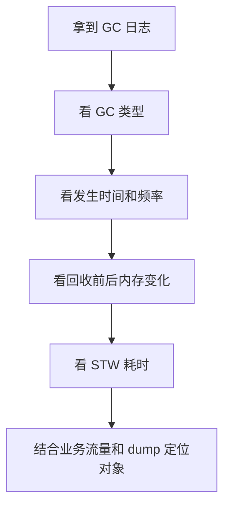

# GC 日志分析实战

## 面试常见问法

- GC 日志怎么看？
- 如何判断 Young GC、Mixed GC 和 Full GC？
- Full GC 频繁时先看哪些指标？
- G1 的 GC 日志重点关注什么？
- 怎么通过日志判断是否存在晋升失败或大对象问题？

## 核心回答

GC 日志分析不是背格式，而是看时间、类型、回收前后内存变化和停顿耗时。Young GC 重点看新生代回收效果和晋升量；Full GC 重点看老年代回收后是否明显下降；G1 还要关注 Young GC、Concurrent Mark、Mixed GC、Humongous 对象和是否退化 Full GC。面试回答要给出步骤：先看频率和耗时，再看回收前后容量，最后结合业务流量和对象分配定位原因。

## 核心概念



## 项目结合

JDK 11+ 推荐开启统一日志。

```bash
java -Xms2g -Xmx2g \
     -XX:+UseG1GC \
     -Xlog:gc*,safepoint:file=/var/log/app-gc.log:time,uptime,level,tags:filecount=10,filesize=100m \
     -jar app.jar
```

分析时可以按关键词快速筛选。

```bash
# 查看 Full GC 或退化回收
grep -E "Full GC|Pause Full" /var/log/app-gc.log

# 查看 G1 大对象相关日志
grep -i "humongous" /var/log/app-gc.log

# 查看 Safepoint 停顿
grep -i "safepoint" /var/log/app-gc.log
```

## 深入追问

- **Full GC 后老年代下降明显说明什么？** 说明对象可回收，可能是内存压力或堆设置不合理。
- **Full GC 后老年代几乎不下降说明什么？** 说明大量对象仍被引用，优先怀疑内存泄漏或缓存无上限。
- **Young GC 很频繁但耗时短怎么办？** 结合 QPS 和 P99 判断是否真的影响业务；如果影响，可以减少对象创建或调整新生代/G1 目标。
- **G1 Mixed GC 的意义是什么？** 并发标记后选择部分回收收益高的 Old Region 和 Young Region 一起回收，避免一次性长时间 Full GC。

## 常见问题

- 不要只看单次 GC 耗时，要看频率和总停顿时间。
- 不要把 “发生 GC” 当成问题，GC 影响 SLA 才需要调优。
- 不要脱离业务流量看日志，高峰期分配速率变化会直接影响 GC。

## 一句话总结

GC 日志分析的面试核心是看类型、频率、回收效果、停顿耗时，再结合 dump 和业务流量定位根因。
