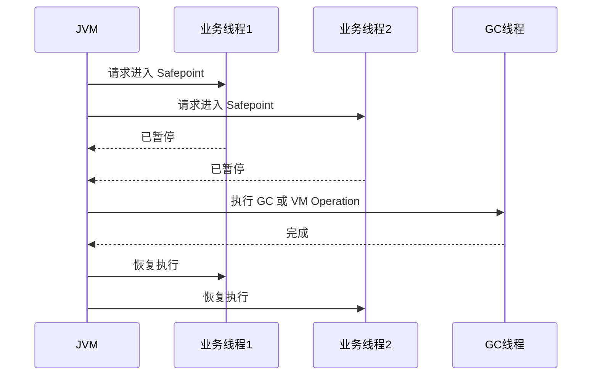

# Safepoint 与 STW

## 面试常见问法

- 什么是 STW？
- 什么是 Safepoint？
- 为什么 GC 需要暂停用户线程？
- 为什么有时没有 Full GC 也会出现长时间停顿？
- 如何排查 Safepoint 停顿？

## 核心回答

STW 是 Stop The World，表示 JVM 暂停所有用户线程执行某些全局操作，例如 GC、偏向锁撤销、类重定义、线程栈遍历等。Safepoint 是线程可以安全暂停的位置，JVM 需要所有线程到达 Safepoint 后才能执行全局操作。长停顿不一定都是 Full GC，也可能是线程迟迟到不了 Safepoint、类加载、锁撤销或其他 VM Operation。

## 核心概念



## 项目结合

JDK 11+ 可以把 GC 和 Safepoint 日志一起打开。

```bash
java -Xlog:gc*,safepoint:file=/var/log/app-gc.log:time,uptime,level,tags \
     -jar app.jar
```

如果接口偶发毛刺但 GC 日志没有明显 Full GC，需要检查 Safepoint 日志和线程状态。

```bash
# 搜索 Safepoint 日志，观察进入安全点耗时和 VM Operation 类型
grep -i "safepoint" /var/log/app-gc.log
```

## 深入追问

- **为什么需要 Safepoint？** JVM 需要在对象引用关系稳定的位置扫描线程栈、更新引用或执行全局操作。
- **哪些操作会触发 STW？** GC、线程 dump、类卸载、类重定义、偏向锁批量撤销、部分 JIT 去优化。
- **为什么线程迟迟进不了 Safepoint？** 线程可能在执行长时间 native 方法、超长循环或缺少可轮询点的代码路径。
- **STW 和 Full GC 是一回事吗？** 不是。Full GC 通常会 STW，但 STW 不只由 Full GC 引起。

## 常见问题

- 不要把所有停顿都归因于 GC。
- 不要只看应用日志，JVM safepoint 日志能解释很多毛刺。
- 不要忽略线程 dump 本身也可能触发短暂停顿。

## 一句话总结

Safepoint 与 STW 的面试核心是理解 JVM 全局暂停机制，并能说明非 Full GC 场景下的停顿排查思路。
