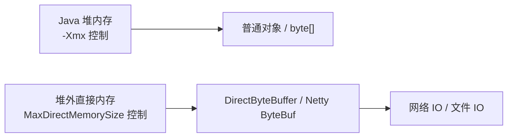

# 直接内存与堆外内存

## 面试常见问法

- 什么是直接内存？
- 直接内存和堆内存有什么区别？
- Netty 为什么大量使用堆外内存？
- RSS 增长但堆正常怎么排查？
- `MaxDirectMemorySize` 有什么用？

## 核心回答

直接内存是 JVM 堆外的一类本地内存，常通过 `ByteBuffer.allocateDirect()` 或 Netty 的堆外 Buffer 使用。它不受 `-Xmx` 直接限制，但会受到 `-XX:MaxDirectMemorySize`、进程可用内存和操作系统限制影响。直接内存能减少一次堆内到内核缓冲区的复制，适合高性能网络 IO，但排查难度比堆内存更高。

## 核心概念



## 项目结合

直接内存分配示例：

```java
public class DirectMemoryDemo {
    public static void main(String[] args) {
        // 分配 64MB 直接内存，不进入 Java 堆
        ByteBuffer buffer = ByteBuffer.allocateDirect(64 * 1024 * 1024);

        // 写入数据时直接操作堆外内存，适合 IO 场景
        buffer.putInt(1);
    }
}
```

生产中建议显式设置直接内存上限。

```bash
java -Xms2g -Xmx2g \
     -XX:MaxDirectMemorySize=512m \
     -XX:NativeMemoryTracking=summary \
     -jar app.jar
```

## 深入追问

- **为什么 Netty 使用堆外内存？** 网络 IO 最终需要和操作系统内核交互，堆外内存可以减少堆内数组到 native buffer 的复制，并降低大 Buffer 对 GC 的压力。
- **直接内存怎么释放？** `DirectByteBuffer` 通过 Cleaner 机制释放堆外内存，释放时机依赖对象可达性和 GC。Netty 使用引用计数管理 `ByteBuf`，必须正确 release。
- **RSS 增长但堆正常怎么办？** 排查直接内存、元空间、线程栈、JNI、本地库和内存映射文件。可以开启 NMT 后使用 `jcmd <pid> VM.native_memory summary`。
- **`MaxDirectMemorySize` 默认是多少？** 不同 JDK 和启动方式可能有差异，工程上建议显式设置，避免堆外内存无限挤占系统内存。

## 常见问题

- 不要以为 `-Xmx` 限制了 Java 进程全部内存。
- 不要用 `jmap` 期望看清所有堆外内存。
- Netty 中不要忘记释放引用计数对象，否则堆外内存泄漏非常隐蔽。

## 一句话总结

直接内存的面试核心是堆外分配、IO 性能收益、`MaxDirectMemorySize` 边界和 RSS 增长但堆正常时的排查。
