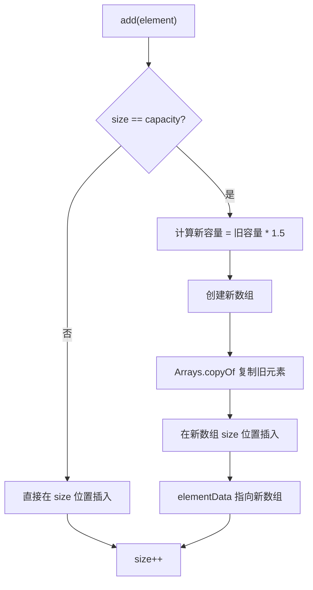

# ArrayList

## 面试常见问法

- `ArrayList` 底层是怎么实现的？
- `ArrayList` 扩容机制是什么？
- `ArrayList` 和 `LinkedList` 怎么选？
- `ArrayList` 是线程安全的吗？并发修改会有什么问题？

## 核心回答

`ArrayList` 底层基于动态数组实现，适合随机访问和尾部追加。它的查询速度快，因为可以通过下标直接定位元素；但中间插入和删除需要移动元素，成本较高。容量不足时会扩容，扩容会创建新数组并复制旧元素，所以如果能预估数量，最好在初始化时指定容量。它不是线程安全的，多线程写入需要额外同步或选择并发集合。

## 背景

在 Java 后端开发中，`ArrayList` 是使用频率最高的集合之一。接口开发中的 DTO 列表组装、数据库查询结果的批量转换、配置项的内存缓存、分页数据的临时存储等场景几乎都会用到它。理解它的底层结构和性能边界，直接影响代码效率和线上稳定性。面试中 `ArrayList` 通常作为集合类考察的起点，面试官会从这里切入扩容、线程安全、与 `LinkedList` 的对比等更深的话题。

## 核心概念

`ArrayList` 的关键点是数组、容量、扩容和元素移动。面试时不要只说"数组实现"，还要能说清楚它适合什么场景、不适合什么场景。



## 项目结合

在后端接口中，经常需要把数据库查询结果转换成 DTO 列表。如果查询结果数量已知，初始化容量可以减少扩容带来的数组复制。

```java
public List<UserDTO> buildUserDTOList(List<UserDO> users) {
    // 已知结果集大小时预设容量，避免 ArrayList 多次扩容
    List<UserDTO> result = new ArrayList<>(users.size());
    for (UserDO user : users) {
        result.add(UserDTO.from(user));
    }
    return result;
}
```

## 深入追问

- **为什么 `ArrayList` 随机访问快？** 底层数组在内存中连续分布，`get(index)` 直接通过 `elementData[index]` 定位，时间复杂度 O(1)。这也是 `ArrayList` 实现了 `RandomAccess` 标记接口的原因，`Collections.binarySearch` 等工具会根据这个标记选择遍历策略。

- **扩容的具体过程是什么？** 调用 `add` 时先执行 `ensureCapacityInternal`，如果 `size + 1 > elementData.length`，则调用 `grow` 方法。新容量计算逻辑为 `oldCapacity + (oldCapacity >> 1)`，即扩为原来的 1.5 倍。然后通过 `Arrays.copyOf` 将旧数组内容复制到新数组。默认初始容量为 10（首次 add 时分配），这意味着一个空 `ArrayList` 连续 add 到第 11 个元素时就会触发第一次扩容。

- **为什么中间删除慢？** `remove(index)` 执行后需要调用 `System.arraycopy` 将 index 之后的所有元素向前移动一位，时间复杂度 O(n)。如果在循环中频繁删除中间元素，应考虑反向遍历或使用 `Iterator.remove`。

- **并发场景怎么处理？** 可以用外部锁、`Collections.synchronizedList` 包装，或按场景选择 [CopyOnWriteArrayList](./04-CopyOnWriteArrayList.md)。`synchronizedList` 是方法级加锁，遍历时仍需手动同步；`CopyOnWriteArrayList` 适合读多写少场景。

## 常见问题

- **遍历时修改导致 `ConcurrentModificationException`**：`ArrayList` 内部维护 `modCount` 计数器，`Iterator` 在创建时记录期望值，遍历过程中如果直接调用 `list.remove` 修改了集合，`modCount` 变化会触发快速失败。正确做法是使用 `Iterator.remove` 或收集待删除元素后统一移除。
- **不要说 `ArrayList` 一定比 `LinkedList` 快**：尾部追加两者性能接近；头部/中间大量插入删除时 `LinkedList` 不需要移动元素，但 `LinkedList` 的节点分散在堆中，缓存命中率低，实际性能还受 CPU 缓存行影响。大多数后端场景仍然优先 `ArrayList`。
- **大批量数据未预设容量**：处理数万条记录的列表时，如果不预设容量，会触发多次扩容和数组复制，在高 QPS 接口中可能引起 GC 压力和响应毛刺。

## 线上案例

**批量导出接口 GC 频繁**：某报表导出接口一次查询返回 5 万条记录，`ArrayList` 使用默认容量，从 10 开始连续扩容十余次（10 → 15 → 22 → ... → 50000+），每次扩容都触发大数组复制和旧数组回收。在高并发导出时叠加，导致 Young GC 频率升高、接口 P99 耗时抖动。修复方式是将 SQL 的 count 查询前置，用返回的总数初始化 `ArrayList` 容量，扩容次数降为零，GC 压力明显下降。

## 相关笔记

- [CopyOnWriteArrayList](./04-CopyOnWriteArrayList.md)：`ArrayList` 的并发替代方案，读多写少场景。
- [HashMap](./02-HashMap.md)：另一个高频集合，面试中经常对比数组与哈希表的结构差异。

## 一句话总结

`ArrayList` 是基于动态数组的顺序集合，适合随机访问和尾部追加，面试重点是扩容机制（1.5 倍 + 数组复制）、元素移动成本和线程安全边界。
