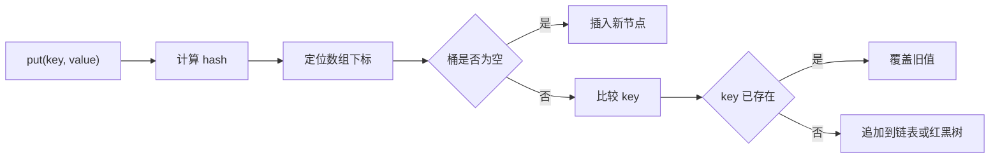

# HashMap

## 面试常见问法

- `HashMap` 的底层结构是什么？
- `HashMap` 的 put 流程是怎样的？
- 为什么重写 `equals` 时必须重写 `hashCode`？
- JDK 8 中 `HashMap` 为什么引入红黑树？
- `HashMap` 是线程安全的吗？

## 核心回答

`HashMap` 是基于哈希表实现的 key-value 容器。JDK 8 中底层结构可以概括为数组、链表和红黑树。put 时会先根据 key 计算 hash，再定位数组下标，如果桶为空就直接插入，如果发生哈希冲突，就在链表或红黑树中比较 key。链表过长且数组容量达到条件时会树化，降低极端冲突下的查询成本。`HashMap` 不是线程安全的，多线程并发写入应该使用 `ConcurrentHashMap`。

## 背景

`HashMap` 是 Java 后端开发中使用最广泛的 key-value 容器。接口开发中的数据分组聚合、本地缓存、配置映射、ID 到对象的快速查找等场景都依赖它。在面试中，`HashMap` 几乎是必考题，考察范围从 put 流程、扩容机制到并发问题，深度可以延伸到源码级别的 hash 扰动、红黑树阈值和 JDK 7 与 JDK 8 的结构变化。

## 核心概念

面试回答 `HashMap` 时，要围绕 hash 定位、冲突处理、扩容、树化和线程安全展开。



## 项目结合

在订单列表接口中，可以先把订单明细按订单 ID 分组，避免为每个订单重复扫描明细列表。

```java
public Map<Long, List<OrderItemDO>> groupItemsByOrderId(List<OrderItemDO> items) {
    Map<Long, List<OrderItemDO>> itemMap = new HashMap<>(items.size());
    for (OrderItemDO item : items) {
        // 按订单 ID 聚合明细，避免后续为每个订单重复扫描明细列表
        itemMap.computeIfAbsent(item.getOrderId(), key -> new ArrayList<>()).add(item);
    }
    return itemMap;
}
```

## 深入追问

- **哈希冲突怎么解决？** JDK 8 中采用链地址法，同一个桶内先用链表存储冲突节点。当链表长度达到 8 且数组容量 >= 64 时，链表转为红黑树（`treeifyBin`）；当红黑树节点数缩减到 6 以下时会退化回链表（`UNTREEIFY_THRESHOLD`）。如果数组容量不足 64，即使链表达到 8 也只会触发扩容而不是树化。

- **hash 扰动函数做了什么？** `HashMap` 的 `hash()` 方法将 key 的 `hashCode()` 高 16 位与低 16 位做异或运算（`h ^ (h >>> 16)`），目的是让高位信息也参与数组下标计算，减少哈希碰撞。数组下标通过 `(n - 1) & hash` 计算，等效于取模但性能更高，这也要求数组容量必须是 2 的幂。

- **扩容（resize）的具体过程？** 当元素数量超过 `capacity * loadFactor`（默认 0.75）时触发扩容，新容量翻倍。JDK 8 中扩容时不需要重新计算 hash，而是利用 `hash & oldCap` 的结果判断节点在新数组中是留在原位还是移动到 `原位 + oldCap` 的位置，这就是高低位链拆分优化。

- **为什么 key 对象不能随意修改字段？** 如果字段参与 `hashCode` 计算，修改后 hash 值变化，会导致 `get` 时定位到错误的桶，原来存入的数据无法找到。实践中推荐使用不可变对象（如 `String`、`Long`）作为 key。

- **为什么不能用 `HashMap` 做多线程共享缓存？** 并发 put 可能导致数据覆盖、链表/树结构损坏。JDK 7 中甚至可能出现链表成环导致 `get` 死循环、CPU 100%。应使用 [ConcurrentHashMap](./03-ConcurrentHashMap.md) 替代。

## 常见问题

- **不要只背"数组加链表"**：必须补充 JDK 8 的红黑树，以及树化/退化的阈值条件（链表长度 8 树化、节点数 6 退化、数组容量 64 是树化的前提）。
- **不要忽略 `equals` 和 `hashCode` 的一致性**：如果两个对象 `equals` 返回 `true`，`hashCode` 必须相同；否则两个"相等"的 key 可能落在不同桶中，导致逻辑错误。
- **初始容量设置不合理**：`new HashMap<>()` 默认容量 16，如果预知元素数量为 n，推荐设置初始容量为 `n / 0.75 + 1` 或直接使用 Guava 的 `Maps.newHashMapWithExpectedSize(n)`，避免中途触发多次 resize。
- **`tableSizeFor` 的容量对齐**：即使传入的初始容量不是 2 的幂，`HashMap` 内部也会通过位运算向上取整到最近的 2 的幂，这是为了保证 `(n - 1) & hash` 的位运算取模正确。

## 线上案例

**JDK 7 并发 put 导致 CPU 100%**：某订单服务使用 `HashMap` 做本地商品信息缓存，多个请求线程并发写入。在 JDK 7 中，并发 resize 导致链表形成环形引用，后续 `get` 操作在环形链表中无限遍历，CPU 使用率飙升到 100%，服务完全不可用。排查方式是通过 `jstack` 发现大量线程阻塞在 `HashMap.get` 方法，定位到 `transfer` 方法的头插法在并发下链表成环。修复方案是将 `HashMap` 替换为 [ConcurrentHashMap](./03-ConcurrentHashMap.md)。虽然 JDK 8 改为尾插法不再成环，但并发写入仍然会导致数据丢失，不能用 `HashMap` 替代并发安全容器。

## 相关笔记

- [ConcurrentHashMap](./03-ConcurrentHashMap.md)：`HashMap` 的并发安全替代方案。
- [ArrayList](./01-ArrayList.md)：另一个高频集合，面试中常与 `HashMap` 对比数组与哈希表的结构差异。

## 一句话总结

`HashMap` 的面试核心是 hash 扰动与定位、链表与红黑树的冲突处理、resize 的高低位链拆分、以及并发不安全的本质原因。
