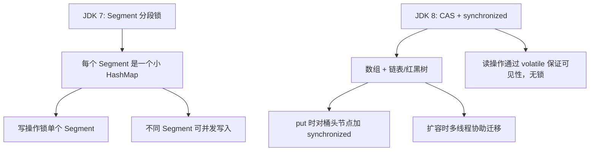

# ConcurrentHashMap

## 面试常见问法

- `ConcurrentHashMap` 为什么线程安全？
- `ConcurrentHashMap` 和 `Hashtable` 有什么区别？
- `ConcurrentHashMap` 可以保证复合业务操作的原子性吗？
- 为什么 `ConcurrentHashMap` 不允许 key 或 value 为 `null`？

## 核心回答

`ConcurrentHashMap` 是线程安全的并发 Map。它通过更细粒度的并发控制减少锁竞争，读操作通常不加全局锁，写操作只锁定必要范围，因此比 `Hashtable` 这种方法级同步容器更适合高并发场景。但它只能保证集合自身单次操作的线程安全，不能自动保证多步业务逻辑的整体原子性。

## 背景

在 Java 后端多线程环境中，经常需要一个线程安全的 Map 来做本地缓存、并发计数、幂等标记、限流计数器等。直接用 `HashMap` 会出现数据竞争，用 `Hashtable` 或 `Collections.synchronizedMap` 锁粒度太大、并发性能差。`ConcurrentHashMap` 是标准方案。面试中它是考察并发集合的核心题目，通常会从线程安全机制切入，进一步追问 JDK 7 分段锁与 JDK 8 CAS + synchronized 的演进。

## 核心概念

面试中要区分"集合方法线程安全"和"业务流程线程安全"。例如 `putIfAbsent` 是原子的，但"先查再改再写"这种业务流程仍然可能需要额外控制。



## 项目结合

在单个 JVM 内，可以用 `ConcurrentHashMap` 做简单的正在处理标记，避免同一个业务键被重复处理。

```java
public class LocalIdempotentGuard {
    private final ConcurrentHashMap<String, Boolean> processingKeys = new ConcurrentHashMap<>();

    public boolean tryEnter(String bizKey) {
        // putIfAbsent 是原子操作，可避免并发请求同时进入关键逻辑
        return processingKeys.putIfAbsent(bizKey, Boolean.TRUE) == null;
    }

    public void exit(String bizKey) {
        // 业务处理结束后及时移除，避免本地内存持续增长
        processingKeys.remove(bizKey);
    }
}
```

## 深入追问

- **JDK 7 和 JDK 8 的并发控制有什么区别？** JDK 7 使用分段锁（`Segment extends ReentrantLock`），将整个 Map 分成若干段，写操作只锁一个段，不同段可以并发写入，但锁粒度是段级别。JDK 8 废弃了分段锁，put 时对桶的头节点使用 `synchronized` 加锁，锁粒度细化到单个桶；初始化和扩容使用 CAS 操作保证线程安全。读操作通过 `volatile` 修饰的 Node 数组和 `val` 字段保证可见性，不需要加锁。

- **和 `Hashtable` 的区别是什么？** `Hashtable` 对所有读写方法使用 `synchronized` 修饰，等价于全表加锁，任何时刻只有一个线程可以操作。`ConcurrentHashMap` 的锁粒度细得多，读操作无锁，写操作只锁必要的桶，并发吞吐量远高于 `Hashtable`。

- **为什么不允许 `null`？** 并发场景下无法区分"key 不存在返回 null"和"value 本身就是 null"。`HashMap` 的 `containsKey` 可以辅助判断，但在并发环境中 `containsKey` 和 `get` 之间可能被其他线程修改，导致判断失效。Doug Lea 在设计时选择直接禁止 null 来消除歧义。

- **`size()` 是否强一致？** `size()` 方法在 JDK 8 中通过 `baseCount` 加 `CounterCell` 数组求和实现（类似 `LongAdder` 的分散计数思想），高并发修改时返回的是近似值。如果需要精确计数，不应依赖 `size()` 作为业务判断条件。

- **多实例部署能不能用它做幂等？** 不能，它只在单 JVM 内生效。分布式环境需要 Redis `SETNX`、数据库唯一约束或分布式锁。

## 常见问题

- **不要说用了 `ConcurrentHashMap` 就天然解决所有并发问题**：它只保证单次 API 调用的原子性。"先 get 判断再 put"这种复合操作仍然存在竞态条件，应使用 `computeIfAbsent`、`compute` 等原子方法替代。
- **不要用它解决分布式并发**：跨 JVM 的幂等、限流和锁需要借助外部存储（Redis、ZooKeeper、数据库）。
- **不要忽略内存清理**：用作本地缓存或标记 Map 时，如果没有过期淘汰机制，Map 会持续膨胀。可以结合定时任务清理、使用 Caffeine 等本地缓存框架，或为标记设置时间边界。
- **`compute` 系列方法中的 lambda 不要有副作用**：`compute`/`merge` 的 lambda 会在持锁状态下执行，如果 lambda 中做了 RPC、IO 或重量级计算，会阻塞其他线程对同一个桶的写入。

## 线上案例

**本地幂等标记内存泄漏**：某支付回调服务使用 `ConcurrentHashMap` 存储已处理的交易流水号，处理完成后忘记 `remove`。上线两天后 Map 中积累了数百万条记录，老年代持续增长，最终触发频繁 Full GC，回调处理延迟飙升。排查时通过 `jmap -histo` 发现 `ConcurrentHashMap$Node` 对象数量异常庞大。修复方案是在处理完成后立即 `remove`，并增加一个定时任务兜底清理超过 30 分钟未移除的 key。

## 相关笔记

- [HashMap](./02-HashMap.md)：理解 `ConcurrentHashMap` 的前提是掌握 `HashMap` 的结构和 put 流程。
- [synchronized](./07-synchronized.md)：JDK 8 的 `ConcurrentHashMap` 在写入时使用 `synchronized` 锁定桶头节点。
- [AQS](./12-AQS.md)：JDK 7 的 `Segment` 继承自 `ReentrantLock`，底层基于 AQS。

## 一句话总结

`ConcurrentHashMap` 解决的是 JVM 内并发 Map 的安全访问问题，面试重点是 JDK 7 分段锁到 JDK 8 CAS + synchronized 的演进、锁粒度、null 禁止原因和单次操作原子性的边界。
