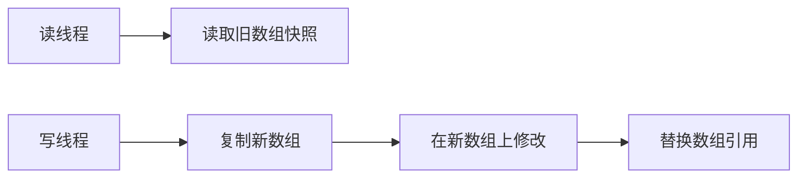

# CopyOnWriteArrayList

## 面试常见问法

- `CopyOnWriteArrayList` 的实现原理是什么？
- 它适合什么场景？
- 为什么它读性能好但写性能差？
- 它和 `ArrayList` 加锁有什么区别？

## 核心回答

`CopyOnWriteArrayList` 使用写时复制思想。读操作直接读取当前数组快照，不需要加锁；写操作会复制一份新数组，在新数组上修改后再替换引用。它适合读多写少的场景，比如监听器列表、白名单快照、配置快照。不适合高频写入或大列表，因为每次写都会复制数组，成本较高。

## 背景

在 Java 后端开发中，有些数据结构的读操作远多于写操作，例如事件监听器注册表、动态配置的本地快照、权限白名单、路由规则列表等。这些场景如果用 `ArrayList` 加 `synchronized`，读操作也要竞争锁，并发度受限。`CopyOnWriteArrayList` 通过写时复制实现读写分离，让读操作完全无锁，是解决"读多写少"并发列表的标准方案。面试中它常和 `ArrayList` 线程安全问题一起出现。

## 核心概念

它的关键不是"线程安全列表"这么简单，而是用写入成本换取读操作无锁和读写隔离。



## 项目结合

领域事件发布器中，监听器注册很少发生，但事件发布非常频繁，可以使用 `CopyOnWriteArrayList`。

```java
public class DomainEventPublisher {
    private final List<DomainEventListener> listeners = new CopyOnWriteArrayList<>();

    public void register(DomainEventListener listener) {
        // 注册频率低，复制数组带来的写成本可以接受
        listeners.add(listener);
    }

    public void publish(DomainEvent event) {
        for (DomainEventListener listener : listeners) {
            // 读操作不加锁，适合高频事件分发
            listener.onEvent(event);
        }
    }
}
```

## 深入追问

- **为什么读不加锁？** 读操作直接访问当前 `array` 引用指向的数组，这个数组在创建后就不会被修改（不可变快照）。写操作是在新数组上修改完成后，通过 `volatile` 语义替换引用，读线程要么看到旧数组要么看到新数组，不会看到中间状态。

- **写入期间读线程看到什么？** 看到的是旧数组快照。新数组在写线程调用 `setArray` 替换引用之前对读线程不可见。这意味着 `CopyOnWriteArrayList` 提供的是最终一致性，而不是强实时一致性。

- **写操作的锁机制是什么？** 写操作（`add`、`set`、`remove`）内部使用 `ReentrantLock` 加锁，保证同一时刻只有一个线程在执行写操作。加锁后先复制当前数组，在新数组上修改，然后替换引用，最后释放锁。

- **大列表为什么不适合？** 每次写操作都要复制整个数组，时间复杂度 O(n)，内存开销也翻倍。如果列表有 10 万个元素，每次 add 都要创建一个 10 万+1 的新数组并复制所有元素，GC 压力和 CPU 开销都很大。

- **和 `Collections.synchronizedList` 的区别？** `synchronizedList` 是对所有方法加 `synchronized`，读写互斥，遍历时还需要手动加锁。`CopyOnWriteArrayList` 读完全无锁，遍历安全（遍历的是快照），但写入代价高。选择取决于读写比例。

## 常见问题

- **不要把它用于高频写入场景**：如果写操作占比超过 10%，复制数组的开销会成为性能瓶颈。应评估读写比例后决定是否使用。
- **不要要求它读到最新写入结果**：写操作完成到读线程看到新引用之间有短暂延迟，对强一致性有要求的场景不适合。
- **不要忽略集合很大时的复制成本**：集合元素数量应控制在合理范围内（通常几百个以内），否则考虑 `ConcurrentHashMap` 配合读写策略替代。
- **遍历期间修改不会抛异常**：和 [ArrayList](./01-ArrayList.md) 不同，`CopyOnWriteArrayList` 的 Iterator 遍历的是创建 Iterator 时的快照，遍历过程中即使有写操作也不会抛 `ConcurrentModificationException`，但遍历看到的是旧数据。

## 线上案例

**动态配置热更新列表过大导致 GC 毛刺**：某网关服务使用 `CopyOnWriteArrayList` 存储路由规则，初期只有几十条规则，运行正常。随着业务接入增多，规则膨胀到 5000+ 条。每次规则变更（约每分钟一次）都会触发 5000 个元素的数组复制，叠加高 QPS 下的频繁 Young GC，导致接口 P99 出现毛刺。修复方案是将路由规则改用 `ConcurrentHashMap<String, RouteRule>` 存储，规则变更只修改单个 key，消除了大数组复制的开销。

## 相关笔记

- [ArrayList](./01-ArrayList.md)：`CopyOnWriteArrayList` 是 `ArrayList` 的并发替代方案，理解底层数组结构是基础。
- [ReentrantLock](./08-ReentrantLock.md)：`CopyOnWriteArrayList` 的写操作内部使用 `ReentrantLock` 保证互斥。
- [volatile](./09-volatile.md)：数组引用的 `volatile` 语义是读操作无锁可见的关键。

## 一句话总结

`CopyOnWriteArrayList` 适合读多写少场景，用写时复制换取无锁读和遍历稳定性，面试重点是写时复制机制、最终一致性语义和集合规模对性能的影响。
