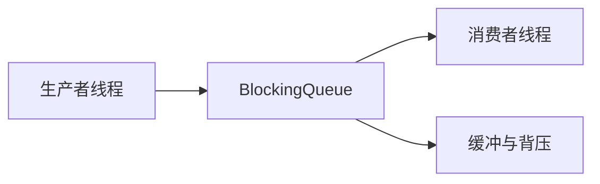

# BlockingQueue

## 面试常见问法

- `BlockingQueue` 有什么作用？
- 阻塞队列如何实现生产者消费者模型？
- `put`、`take`、`offer`、`poll` 有什么区别？
- 线程池为什么需要阻塞队列？

## 核心回答

`BlockingQueue` 是支持阻塞语义的队列，常用于生产者消费者模型。当队列为空时，消费者可以阻塞等待；当队列满时，生产者可以阻塞或失败返回。它既是数据缓冲区，也是线程协作工具。在 Java 后端中，常用于异步任务、日志缓冲、批量写入和线程池任务排队。

## 背景

在 Java 后端系统中，很多场景需要解耦生产和消费的速率差异：接口产生审计日志但不能同步写库、订单创建后异步发送通知、批量数据需要攒批后统一处理。`BlockingQueue` 是 JVM 内实现这种解耦和削峰的基础组件，也是 `ThreadPoolExecutor` 的核心参数之一。面试中它经常和线程池一起考察，也是理解生产者消费者模型和背压机制的切入点。

## 核心概念

面试中要把它讲成"缓冲、削峰、背压、线程协作"，而不是只说"一个队列"。



## 项目结合

接口请求产生审计日志时，可以先写入阻塞队列，由后台线程批量落库，降低接口响应耗时。

```java
public class AuditLogBuffer {
    private final BlockingQueue<AuditLog> queue = new ArrayBlockingQueue<>(1000);

    public boolean offer(AuditLog log) {
        // 使用 offer 避免接口线程在队列满时无限阻塞
        return queue.offer(log);
    }

    public AuditLog take() throws InterruptedException {
        // 消费者没有数据时阻塞等待，避免空转浪费 CPU
        return queue.take();
    }
}
```

## 深入追问

- **`put` 和 `offer` 怎么选？** `put` 在队列满时会阻塞当前线程直到有空间，适合后台消费者之间的协作。`offer` 在队列满时立即返回 `false`，还有带超时的重载 `offer(e, timeout, unit)`。接口线程通常更适合 `offer`，避免用户请求因队列满而长时间阻塞；后台批量写入场景可以用 `put`。

- **常见的 `BlockingQueue` 实现有哪些？** `ArrayBlockingQueue` 基于定长数组，创建时必须指定容量，内部使用一把 `ReentrantLock`；`LinkedBlockingQueue` 基于链表，默认容量为 `Integer.MAX_VALUE`（使用时必须手动指定容量，否则等于无界），内部读写各有一把锁，并发度更高；`SynchronousQueue` 容量为 0，每次 put 必须等待一个 take 配对，适合直接交付（线程池的 `CachedThreadPool` 使用它）；`PriorityBlockingQueue` 支持按优先级出队。

- **队列容量怎么定？** 需要结合生产速度、消费速度、内存限制和降级策略。容量太小会频繁触发拒绝或阻塞；容量太大会占用过多内存，且问题暴露滞后。通常先评估消费速率的上限，取 1-5 秒的缓冲量作为容量起点，再结合压测调整。

- **队列满了怎么办？** 应有明确的降级策略：拒绝并返回错误、记录到本地日志后异步补偿、投递到 MQ 做持久化缓冲、触发限流或熔断。不能简单忽略丢弃。

- **`BlockingQueue` 和 MQ 的区别是什么？** `BlockingQueue` 是进程内队列，重启后数据丢失，不支持跨服务消费，无持久化和重试机制。MQ（如 RocketMQ、Kafka）是跨进程的可靠消息系统，支持持久化、重试、死信、广播和顺序消费。进程内异步解耦用 `BlockingQueue`，跨服务或需要可靠投递时用 MQ。

## 常见问题

- **不要使用无界队列承接不可控流量**：`LinkedBlockingQueue` 不指定容量时默认为 `Integer.MAX_VALUE`，等于无界队列，生产速度持续高于消费速度时会导致内存持续增长直到 OOM。这也是 `Executors.newFixedThreadPool` 被不推荐使用的原因之一。
- **不要忽略消费者异常退出后的队列堆积**：如果消费者线程因未捕获异常退出，队列中的数据会持续堆积。应对消费者线程增加异常捕获和自动重启机制。
- **不要把进程内队列当作可靠消息中间件**：JVM 重启、宕机都会导致队列中未消费的数据丢失。对数据可靠性有要求的场景必须使用 MQ 或数据库兜底。
- **注意 `drainTo` 的非原子性**：`drainTo` 批量取出元素时不是原子操作，其他线程可能在中间插入新元素。批量处理后要考虑剩余元素。

## 线上案例

**无界队列导致 OOM**：某服务使用 `Executors.newFixedThreadPool(10)` 创建线程池处理异步通知，底层使用的 `LinkedBlockingQueue` 未指定容量（默认无界）。一次下游通知服务故障，消费速度骤降，大量任务堆积在队列中。堆内存持续增长，最终触发 OOM，整个服务不可用。排查时通过 `jmap -histo` 发现 `LinkedBlockingQueue$Node` 对象占用了大量内存。修复方案是改用 `new ThreadPoolExecutor` 手动创建线程池，使用 `ArrayBlockingQueue(500)` 限定容量，并配置拒绝策略记录日志和触发告警。

## 相关笔记

- [线程池 ThreadPoolExecutor](./06-线程池-ThreadPoolExecutor.md)：线程池的任务排队依赖 `BlockingQueue`，队列类型和容量直接影响线程池行为。
- [ReentrantLock](./08-ReentrantLock.md)：`ArrayBlockingQueue` 内部使用 `ReentrantLock` 和 `Condition` 实现阻塞语义。
- [AQS](./12-AQS.md)：`BlockingQueue` 实现的底层锁和条件队列机制基于 AQS。

## 一句话总结

`BlockingQueue` 是 Java 线程协作和削峰缓冲的基础组件，面试重点是阻塞语义、有界 vs 无界的选择、背压设计和与 MQ 的边界区分。
