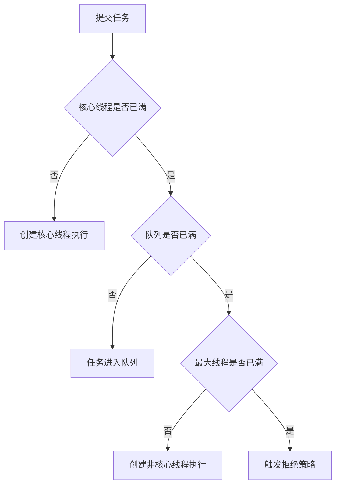

# 线程池 ThreadPoolExecutor

## 面试常见问法

- 线程池的核心参数有哪些？
- 线程池提交任务后的执行流程是什么？
- 为什么不建议直接使用 `Executors` 创建线程池？
- 线程池参数应该怎么设置？
- 线程池满了以后会发生什么？

## 核心回答

线程池用于复用线程、限制并发、隔离资源和管理任务队列。`ThreadPoolExecutor` 的核心参数包括核心线程数、最大线程数、存活时间、阻塞队列、线程工厂和拒绝策略。任务提交后，通常先使用核心线程执行；核心线程满了进入队列；队列满了再创建非核心线程；达到最大线程数后触发拒绝策略。面试时要强调线程池不是简单异步工具，而是资源治理手段。

## 背景

在 Java 后端系统中，线程池几乎无处不在：异步通知、批量导出、接口聚合调用、定时任务、MQ 消费者并发处理等都依赖线程池。直接 `new Thread` 会导致线程创建销毁开销大、并发不可控、资源无法隔离。`ThreadPoolExecutor` 是 Java 提供的标准线程池实现，也是面试中并发方向的核心考点，面试官通常从参数含义切入，追问到执行流程、拒绝策略、线程池隔离和监控实践。

## 核心概念



## 项目结合

订单支付成功后，可以把短信、站内信、积分发放拆到独立线程池，但必须设置容量和拒绝策略。

```java
public ThreadPoolExecutor createNotifyExecutor() {
    return new ThreadPoolExecutor(
            8,
            16,
            60,
            TimeUnit.SECONDS,
            new ArrayBlockingQueue<>(500),
            runnable -> {
                Thread thread = new Thread(runnable);
                // 设置线程名，便于日志检索和线上排查
                thread.setName("order-notify-" + thread.getId());
                return thread;
            },
            (task, executor) -> {
                // 拒绝时记录日志或投递到补偿任务，避免静默丢失业务动作
                throw new RejectedExecutionException("订单通知线程池已满");
            });
}
```

## 深入追问

- **CPU 密集型和 IO 密集型线程数如何估算？** CPU 密集型任务线程数接近 CPU 核数（`Runtime.getRuntime().availableProcessors()`），避免过多上下文切换。IO 密集型任务线程大部分时间在等待 IO 返回，可以适当放大，常见估算公式为 `CPU 核数 * (1 + IO 等待时间 / CPU 计算时间)`。但公式只是起点，实际需要通过压测验证，观察 CPU 使用率、线程池活跃线程数和任务排队时间来调整。

- **为什么不建议 `Executors.newFixedThreadPool`？** 它内部使用 `new LinkedBlockingQueue<>()`，容量为 `Integer.MAX_VALUE`，等于无界队列。当消费速度跟不上提交速度时，任务在队列中无限堆积，最终导致 OOM。`newCachedThreadPool` 的问题是最大线程数为 `Integer.MAX_VALUE`，可能创建过多线程。推荐手动 `new ThreadPoolExecutor` 并显式设置有界队列和拒绝策略。

- **四种内置拒绝策略的区别？** `AbortPolicy`（默认）直接抛 `RejectedExecutionException`；`CallerRunsPolicy` 由提交任务的线程自己执行，起到限流效果但会阻塞调用方；`DiscardPolicy` 静默丢弃任务；`DiscardOldestPolicy` 丢弃队列头部最旧的任务。核心业务不能静默丢弃，应使用 `AbortPolicy` 配合日志和告警，或自定义拒绝策略将任务投递到补偿链路。

- **如何监控线程池？** 关注以下指标：`getActiveCount()`（活跃线程数）、`getQueue().size()`（队列排队长度）、`getCompletedTaskCount()`（已完成任务数）、`getRejectedExecutionHandler()` 的触发次数。可以定期上报到监控系统（Prometheus + Grafana），或使用 Spring Boot Actuator 暴露线程池指标。队列长度持续增长是最早的预警信号。

- **核心线程会超时回收吗？** 默认不会，核心线程即使空闲也会保持存活。可以调用 `allowCoreThreadTimeOut(true)` 让核心线程也受 `keepAliveTime` 控制，适合流量波动大的场景，避免低峰期占用线程资源。

## 常见问题

- **不要所有业务共用一个线程池**：不同业务的耗时和重要性不同，共用线程池会导致慢任务拖垮快任务。应按业务域隔离线程池，例如订单通知池、报表导出池、消息消费池各自独立。
- **不要只调大线程数来解决慢任务问题**：慢任务的根因通常是下游响应慢、SQL 未优化或资源瓶颈。盲目加线程只会把压力转移到下游，甚至加剧超时和资源竞争。应先定位慢的根因。
- **不要忽略下游接口容量**：线程池并发过高会把压力传给下游服务或数据库，可能击穿下游限流阈值。线程池的并发上限要和下游容量匹配。
- **不要忽略线程池的优雅关闭**：应用停止时应调用 `shutdown()` 等待队列中的任务执行完成，或 `shutdownNow()` 中断正在执行的任务。Spring 中可以通过 `@PreDestroy` 或注册 ShutdownHook 实现。

## 线上案例

**线程池队列堆积导致 OOM**：某营销服务使用 `Executors.newFixedThreadPool(20)` 处理优惠券发放异步任务。一次大促期间优惠券发放请求量暴增，线程池的 20 个线程处理不过来，任务持续堆积在无界队列中。30 分钟后堆内存耗尽，触发 Full GC 后仍然无法释放（队列中的任务对象都是强引用），服务 OOM 崩溃。排查时 heap dump 显示 `LinkedBlockingQueue$Node` 对象占据了 80% 的堆内存。修复方案：改为手动创建 `ThreadPoolExecutor`，队列使用 `ArrayBlockingQueue(2000)`，拒绝策略记录日志并投递到 RocketMQ 做异步补偿，同时增加线程池队列长度的监控告警（队列长度 > 1000 时报警）。

## 相关笔记

- [BlockingQueue](./05-BlockingQueue.md)：线程池的任务排队依赖阻塞队列，队列类型直接影响线程池行为。
- [CompletableFuture](./11-CompletableFuture.md)：异步编排通常需要指定自定义线程池，避免使用公共 ForkJoinPool。
- [synchronized](./07-synchronized.md)：线程池内任务共享资源时仍需加锁保护。

## 一句话总结

线程池的面试重点是执行流程（核心线程→队列→非核心线程→拒绝）、参数含义、拒绝策略设计和业务隔离，本质是并发资源治理。
