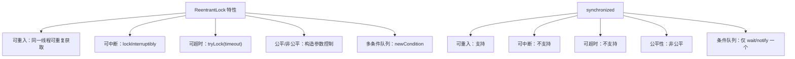

# ReentrantLock

## 面试常见问法

- `ReentrantLock` 和 `synchronized` 有什么区别？
- 什么是可重入锁？
- `tryLock` 有什么用？
- 为什么使用 `ReentrantLock` 必须在 `finally` 中释放锁？

## 核心回答

`ReentrantLock` 是 JUC 提供的显式锁，和 `synchronized` 一样支持可重入，但它提供了更强的控制能力，例如尝试加锁、可中断加锁、公平锁和多个条件队列。缺点是必须手动释放锁，代码复杂度更高。如果只是简单互斥，优先考虑 `synchronized`；如果需要超时、可中断或条件队列，再考虑 `ReentrantLock`。

## 背景

在 Java 后端开发中，`synchronized` 能满足大部分互斥需求，但某些场景需要更灵活的锁控制：接口调用需要限时获取锁避免长时间阻塞、后台任务需要响应中断信号优雅退出、生产者消费者需要多个条件队列分别唤醒。`ReentrantLock` 是这些高级需求的标准方案。面试中它经常和 `synchronized` 做对比，面试官会追问到 AQS 的实现原理和公平/非公平锁的取舍。

## 核心概念

可重入表示同一个线程已经持有锁时，可以再次获取同一把锁，不会把自己阻塞住。



## 项目结合

对本地资源做限时抢占时，可以用 `tryLock` 避免线程长时间阻塞。

```java
public class LocalResourceUpdater {
    private final ReentrantLock lock = new ReentrantLock();

    public boolean updateWithTimeout() throws InterruptedException {
        boolean locked = lock.tryLock(200, TimeUnit.MILLISECONDS);
        if (!locked) {
            return false;
        }

        try {
            // 获取锁后执行共享资源更新，确保同一时刻只有一个线程进入
            doUpdate();
            return true;
        } finally {
            // 必须在 finally 中释放锁，避免异常导致锁无法释放
            lock.unlock();
        }
    }

    private void doUpdate() {
        // 执行本地资源更新逻辑
    }
}
```

## 深入追问

- **公平锁和非公平锁有什么区别？** 公平锁（`new ReentrantLock(true)`）按照线程等待时间排队获取锁，保证先到先得，但每次获取锁都需要检查等待队列，吞吐量通常比非公平锁低。非公平锁（默认）允许新到的线程直接尝试 CAS 获取锁，如果恰好锁刚被释放就能直接拿到，减少了线程切换开销，但可能导致等待时间长的线程饥饿。大多数场景优先使用非公平锁。

- **`lockInterruptibly` 有什么意义？** 使用 `lock()` 获取锁时，线程会无限阻塞直到拿到锁，无法响应中断。`lockInterruptibly()` 允许等待锁的线程被中断并抛出 `InterruptedException`，适合需要优雅退出的后台任务。

- **`Condition` 相比 `wait/notify` 有什么优势？** 一把 `ReentrantLock` 可以创建多个 `Condition`，实现精确唤醒。例如 `ArrayBlockingQueue` 内部用 `notEmpty` 和 `notFull` 两个条件，生产者只唤醒消费者，消费者只唤醒生产者，避免了 `notifyAll` 的无差别唤醒开销。

- **底层如何实现的？** `ReentrantLock` 内部维护一个 `Sync` 对象（继承自 [AQS](./12-AQS.md)），通过 AQS 的 `state` 字段记录重入次数。`lock()` 时尝试 CAS 将 state 从 0 改为 1，成功则获取锁；失败则进入 AQS 的 CLH 等待队列。`unlock()` 将 state 减一，归零时释放锁并唤醒后继节点。

- **为什么要手动释放？** `synchronized` 是语言层面的关键字，JVM 保证方法退出或异常时自动释放 Monitor。`ReentrantLock` 是 API 级别的锁，必须显式调用 `unlock()`，如果遗漏会导致其他线程永远无法获取锁。

## 常见问题

- **不要忘记在 `finally` 中 `unlock`**：这是使用 `ReentrantLock` 最常见的 bug。如果 `try` 块中抛出异常且没有 `finally` 释放锁，锁会被永久持有，其他线程全部阻塞。代码审查时应重点检查。
- **不要为了显得高级而在简单场景过度使用显式锁**：如果不需要超时、中断或多条件队列，`synchronized` 更简洁、更不易出错，且 JDK 6 之后的锁升级优化使其性能已经很好。
- **不要忽略公平锁的性能成本**：公平锁的吞吐量通常比非公平锁低 10%-30%，只有在业务上确实不能容忍线程饥饿时才使用。
- **`lock()` 不要写在 `try` 块内**：如果 `lock()` 放在 `try` 内且 `lock()` 之前的代码抛异常，`finally` 中的 `unlock()` 会在未加锁的情况下执行，抛出 `IllegalMonitorStateException`。正确写法是 `lock()` 在 `try` 之前。

## 线上案例

**未在 finally 释放锁导致线程全部阻塞**：某支付服务使用 `ReentrantLock` 保护本地限流计数器。开发人员在 `try` 块中执行了远程调用，当远程调用抛出 `RuntimeException` 时，由于 `unlock()` 没有放在 `finally` 中，锁未被释放。后续所有请求线程在 `lock()` 处阻塞，接口完全不可用。监控上表现为线程数持续增长但 QPS 为 0。通过 `jstack` 发现大量线程 WAITING 在 `ReentrantLock.lock()`，定位到持有锁的线程已经因异常退出但未释放锁。修复方案是将 `unlock()` 移入 `finally` 块，并增加 `tryLock` 超时机制避免无限等待。

## 相关笔记

- [synchronized](./07-synchronized.md)：内置锁与显式锁的对比是面试高频考点。
- [AQS](./12-AQS.md)：`ReentrantLock` 的底层实现基于 AQS，理解 AQS 的 state 和 CLH 队列是关键。
- [BlockingQueue](./05-BlockingQueue.md)：`ArrayBlockingQueue` 内部使用 `ReentrantLock` + `Condition` 实现阻塞语义。
- [CopyOnWriteArrayList](./04-CopyOnWriteArrayList.md)：写操作使用 `ReentrantLock` 保证互斥。

## 一句话总结

`ReentrantLock` 是更灵活的显式可重入锁，面试重点是与 `synchronized` 的对比（超时、中断、公平性、条件队列）、AQS 实现原理和 `finally` 释放锁的强制规范。
