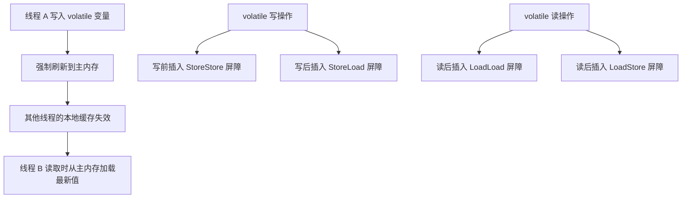

# volatile

## 面试常见问法

- `volatile` 有什么作用？
- `volatile` 能保证原子性吗？
- `volatile` 和 `synchronized` 有什么区别？
- `volatile` 适合哪些场景？

## 核心回答

`volatile` 主要保证变量的可见性，并在一定程度上禁止指令重排序。一个线程修改 volatile 变量后，其他线程能够及时看到最新值。但它不能保证复合操作的原子性，例如 `count++` 仍然不是线程安全的。它适合状态标记、开关变量、单例双重检查中的引用发布等场景。

## 背景

Java 内存模型（JMM）允许线程将变量缓存在本地工作内存中，导致一个线程的修改对另一个线程不可见。此外，编译器和 CPU 为了优化性能可能对指令重排序，破坏多线程下的预期执行顺序。`volatile` 是 JMM 中最轻量的同步手段，用于解决可见性和有序性问题。在后端开发中，它常出现在优雅停机标记、双重检查锁定的单例模式、配置热更新的开关变量等场景。面试中它是考察 JMM 理解深度的切入点。

## 核心概念

面试中要明确三件事：可见性、禁止重排序、不保证复合操作原子性。



> JVM 通过内存屏障（Memory Barrier）实现 volatile 语义。写操作前后的屏障保证写入不会被重排序到后续操作之后；读操作后的屏障保证后续读取不会被重排序到当前读之前。

## 项目结合

后台任务需要响应停止信号时，可以使用 `volatile` 标记。

```java
public class ReportWorker implements Runnable {
    private volatile boolean running = true;

    public void shutdown() {
        // 修改停止标记后，工作线程能够及时看到变化
        running = false;
    }

    @Override
    public void run() {
        while (running) {
            // 执行报表生成或轮询任务
            doWorkOnce();
        }
    }

    private void doWorkOnce() {
        // 执行单次任务逻辑
    }
}
```

## 深入追问

- **为什么 `count++` 不安全？** `count++` 等价于 `temp = count; temp = temp + 1; count = temp;`，包含读取、修改、写回三个步骤。两个线程可能同时读到相同的值，各自加一后写回，导致一次自增丢失。`volatile` 只保证每次读取的是最新值，但不能保证"读-改-写"这个复合操作的整体原子性。需要 `AtomicInteger` 或加锁。

- **和锁有什么区别？** `synchronized` 保证互斥、可见性和有序性，但有线程切换和竞争的性能开销。`volatile` 只保证可见性和有序性，不提供互斥，开销极低（只是内存屏障指令）。如果只需要一个线程写、其他线程读的可见性保证，用 `volatile` 就够了；如果涉及多个线程竞争写入，必须用锁。

- **什么是指令重排序？** 编译器、JIT 和 CPU 在不影响单线程执行结果的前提下，可能调整指令的执行顺序以提高流水线效率。在多线程环境下，重排序可能导致一个线程观察到另一个线程的操作顺序与代码顺序不一致。`volatile` 通过 happens-before 规则禁止特定的重排序。

- **双重检查锁定为什么需要 `volatile`？** 单例模式中 `instance = new Singleton()` 实际包含三步：分配内存、调用构造方法、将引用赋给 `instance`。指令重排序可能导致步骤 2 和 3 互换，另一个线程看到 `instance != null` 但对象尚未初始化完成，使用时会出错。`volatile` 禁止这种重排序，保证对象完全初始化后才对外可见。

- **`volatile` 数组能保证元素可见性吗？** 不能。`volatile` 修饰的是数组引用，保证引用本身的可见性；数组中各个元素的读写不受 `volatile` 保护。如果需要元素级别的可见性，应使用 `AtomicIntegerArray` 或 `AtomicReferenceArray`。

## 常见问题

```java
private volatile int count = 0;

public void increment() {
    // count++ 是读、改、写三个步骤，volatile 不能保证整体原子性
    count++;
}
```

- **不要把 `volatile` 当作轻量锁**：它不能保护临界区，不能替代 `synchronized` 或 `ReentrantLock`。
- **不要在多线程写入场景使用 `volatile` 代替原子类**：多线程同时 `count++` 必须使用 `AtomicLong` 或加锁。
- **不要忽略 `volatile` 对性能的微小影响**：虽然比锁轻量得多，但内存屏障仍有成本。在极高频的热点循环中，不必要的 `volatile` 读写可能影响 CPU 缓存行效率。
- **不要滥用 `volatile`**：只有在确实存在多线程可见性问题时才使用，单线程代码中加 `volatile` 没有意义且可能阻碍编译器优化。

## 线上案例

**配置开关未加 `volatile` 导致灰度放量失效**：某服务使用一个普通布尔变量 `enableNewLogic` 控制新逻辑的灰度开关，通过后台接口修改。上线后发现部分实例的请求始终走旧逻辑，重启后恢复正常。排查发现该变量未加 `volatile`，JIT 编译器将循环中的变量读取优化为寄存器缓存，导致修改后工作线程无法感知新值。修复方案是将 `enableNewLogic` 声明为 `volatile`，保证每次读取都从主内存加载最新值。

## 相关笔记

- [synchronized](./07-synchronized.md)：`synchronized` 同时保证互斥和可见性，`volatile` 只保证可见性。
- [CopyOnWriteArrayList](./04-CopyOnWriteArrayList.md)：内部数组引用使用 `volatile` 保证读线程的可见性。
- [ConcurrentHashMap](./03-ConcurrentHashMap.md)：JDK 8 中 Node 数组和 val 字段使用 `volatile` 保证读操作无锁可见。

## 一句话总结

`volatile` 解决的是可见性和有序性问题，不解决复合操作的原子性问题，面试重点是 JMM 内存屏障、happens-before 规则和双重检查锁定的经典用法。
