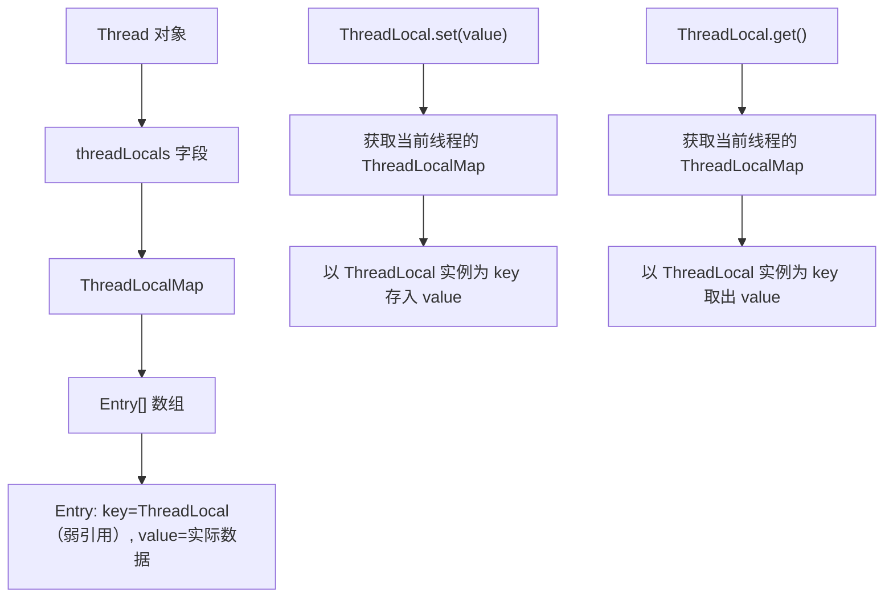

# ThreadLocal

## 面试常见问法

- `ThreadLocal` 是什么？适合什么场景？
- `ThreadLocal` 为什么可能导致内存泄漏？
- 在线程池中使用 `ThreadLocal` 要注意什么？
- `ThreadLocal` 能跨线程传递数据吗？

## 核心回答

`ThreadLocal` 用于保存线程私有变量，每个线程都可以访问自己的副本，常用于用户上下文、TraceId、租户标识、数据源路由等请求级上下文。它解决的是线程内上下文传递问题，不是线程间共享问题。在线程池中线程会被复用，所以请求结束后必须调用 `remove` 清理，否则可能导致上下文串用或内存泄漏。

## 背景

在 Java 后端 Web 应用中，一个 HTTP 请求从 Controller 到 Service 再到 DAO，经常需要传递当前登录用户 ID、租户标识、TraceId 等上下文信息。如果通过方法参数逐层传递，代码侵入性大、改造成本高。`ThreadLocal` 可以在同一线程内透明传递这些上下文，是 Spring 框架（`RequestContextHolder`）、日志组件（MDC）和多数据源路由等基础设施的核心机制。面试中它是考察线程安全和内存管理理解深度的重要题目。

## 核心概念

面试时要强调：`ThreadLocal` 的生命周期经常和线程绑定，而 Web 请求的生命周期通常短于线程池线程。



> 每个 Thread 对象持有一个 `ThreadLocalMap`，它是 `ThreadLocal` 的静态内部类。Map 的 key 是 `ThreadLocal` 实例（弱引用），value 是线程私有数据。当 `ThreadLocal` 实例被 GC 回收后，key 变为 null，但 value 仍然被 Entry 强引用持有，这就是内存泄漏的根源。

## 项目结合

在 Web 请求入口保存当前登录用户，业务代码可以从上下文中读取。

```java
public class UserContext {
    private static final ThreadLocal<Long> CURRENT_USER_ID = new ThreadLocal<>();

    public static void setUserId(Long userId) {
        CURRENT_USER_ID.set(userId);
    }

    public static Long getUserId() {
        return CURRENT_USER_ID.get();
    }

    public static void clear() {
        // 请求结束必须清理，避免线程复用导致用户上下文串用
        CURRENT_USER_ID.remove();
    }
}
```

```java
public void doFilter(ServletRequest request, ServletResponse response, FilterChain chain) throws IOException, ServletException {
    try {
        // 从认证信息中解析用户 ID，并写入线程上下文
        UserContext.setUserId(parseUserId(request));
        chain.doFilter(request, response);
    } finally {
        // 无论请求是否异常，都必须清理 ThreadLocal
        UserContext.clear();
    }
}
```

## 深入追问

- **为什么会内存泄漏？** `ThreadLocalMap` 的 Entry 使用弱引用持有 key（`ThreadLocal` 实例），但 value 是强引用。当外部不再持有 `ThreadLocal` 的强引用时，GC 会回收 `ThreadLocal` 对象，此时 Entry 的 key 变为 null，但 value 仍然被 Entry 持有。如果线程长期存活（如线程池线程），这些 key 为 null 的 Entry 无法被访问也无法被回收，导致内存泄漏。虽然 `ThreadLocalMap` 在 `get`/`set`/`remove` 时会探测并清理 stale Entry，但不能保证所有泄漏都被及时清理。最可靠的做法是主动调用 `remove()`。

- **key 为什么用弱引用？** 如果 key 是强引用，即使外部代码不再使用某个 `ThreadLocal`，Entry 仍然持有它的强引用，`ThreadLocal` 对象和 value 都无法被回收。弱引用让 `ThreadLocal` 对象在没有外部强引用时可以被 GC 回收，减小了泄漏范围（只剩 value 泄漏），是一种折中设计。

- **异步任务能直接读到父线程上下文吗？** 通常不能。`ThreadLocal` 的数据存储在当前线程的 `ThreadLocalMap` 中，新线程有自己独立的 Map。如果需要跨线程传递，可以使用 `InheritableThreadLocal`（只支持线程创建时继承，不支持线程池复用场景），或使用阿里巴巴的 `TransmittableThreadLocal`（TTL），它通过包装 `Runnable`/`Callable` 在任务提交时捕获父线程上下文并在子线程执行时恢复。

- **和方法参数传递怎么取舍？** 简单链路优先显式传参，代码更清晰、更好测试。跨多层通用上下文（用户 ID、TraceId、租户标识）才考虑 `ThreadLocal`，避免参数污染业务方法签名。

- **`ThreadLocalMap` 的 hash 冲突怎么解决？** 使用开放地址法（线性探测），而不是 `HashMap` 的链地址法。发生冲突时向后探测下一个空槽位。这种设计适合 Entry 数量较少的场景。

## 常见问题

- **不要在线程池场景忘记 `remove`**：线程池线程长期存活，上一个请求设置的值会残留给下一个请求。最严重的后果是用户上下文串用——A 用户的请求看到 B 用户的数据。必须在 `finally` 中调用 `remove`。
- **不要把大对象放进 `ThreadLocal`**：线程池中每个线程都会持有一份副本，大对象乘以线程数会占用大量内存。如果需要缓存大对象，应使用独立的缓存方案。
- **不要默认认为它能跨线程传递**：标准 `ThreadLocal` 不能跨线程。`InheritableThreadLocal` 只在 `new Thread` 时继承，线程池复用时不会重新继承。线程池场景需要 `TransmittableThreadLocal`。
- **注意 Spring 框架中的隐式使用**：`RequestContextHolder`、`SecurityContextHolder`、`LocaleContextHolder` 等都基于 `ThreadLocal`。如果在异步线程中访问这些上下文，需要手动传递或配置 `TaskDecorator`。

## 线上案例

**ThreadLocal 未清理导致用户数据串用**：某 SaaS 系统使用 `ThreadLocal` 存储当前租户 ID，用于多租户数据隔离。Filter 中设置租户 ID 但 `finally` 块缺少 `remove` 调用。在 Tomcat 线程池复用的情况下，某次请求异常退出后 `ThreadLocal` 中残留了上一个租户的 ID。下一个不同租户的请求复用了该线程，查询到了其他租户的数据。该问题间歇性出现且难以复现，最终通过在日志中打印 `Thread.currentThread().getName()` 和 `tenantId`，发现同一个线程前后处理了不同租户的请求且租户 ID 未更新。修复方案是在 Filter 的 `finally` 中增加 `TenantContext.clear()`，并增加防御性校验——在 `set` 之前检查是否残留旧值并记录告警。

## 相关笔记

- [线程池 ThreadPoolExecutor](./06-线程池-ThreadPoolExecutor.md)：线程池线程复用是 `ThreadLocal` 泄漏和串用的核心原因。
- [volatile](./09-volatile.md)：`ThreadLocal` 解决的是线程内数据隔离，`volatile` 解决的是线程间可见性，两者解决不同问题。

## 一句话总结

`ThreadLocal` 适合线程内上下文传递，面试重点是 `ThreadLocalMap` 的弱引用 key 导致的内存泄漏机制、线程池复用下必须 `remove` 的规范、以及跨线程传递的局限与解决方案。
