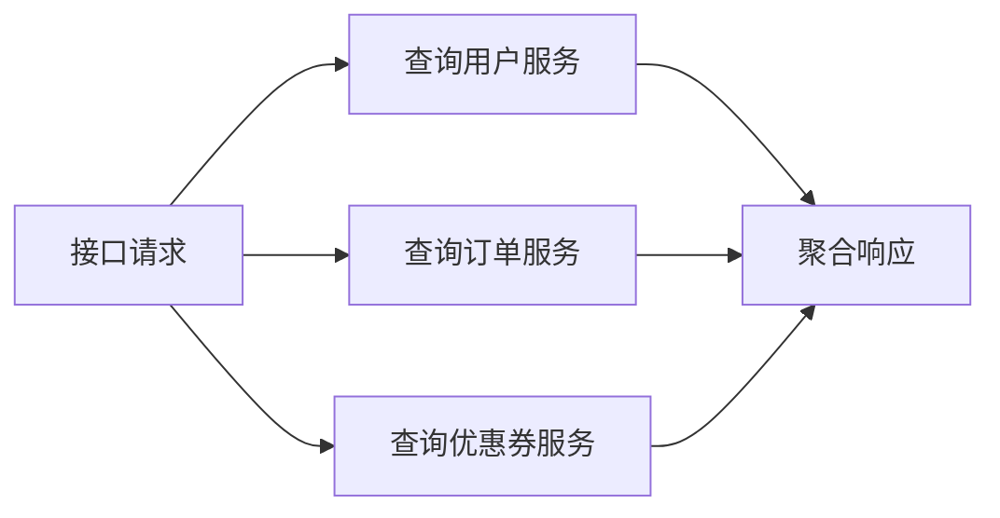

# CompletableFuture

## 面试常见问法

- `CompletableFuture` 解决什么问题？
- 如何用它做异步任务编排？
- 使用 `CompletableFuture` 要注意哪些坑？
- 为什么不建议默认使用公共线程池处理阻塞 IO？

## 核心回答

`CompletableFuture` 是 Java 中用于异步计算和任务编排的工具，可以表达异步执行、结果组合、异常处理和任务聚合。后端接口中，如果多个下游查询互不依赖，可以并发执行再聚合结果，降低接口总耗时。工程上要重点关注线程池隔离、超时控制、异常处理和下游容量，不能只为了异步而异步。

## 背景

在 Java 后端系统中，很多接口需要聚合多个下游服务的数据：用户首页需要同时查询用户信息、订单列表和优惠券数量；商品详情页需要查询基本信息、库存、评价和推荐。如果串行调用，总耗时等于各调用耗时之和；如果并发调用，总耗时只取决于最慢的那个。`CompletableFuture` 是 JDK 8 提供的标准异步编排工具，替代了早期的 `Future.get()` 阻塞模式。面试中它常考察异步编排能力和线程池管理意识。

## 核心概念



## 项目结合

用户首页需要同时查询用户信息、最近订单和优惠券数量，可以并发执行。

```java
public HomePageDTO buildHomePage(Long userId) {
    CompletableFuture<UserDTO> userFuture = CompletableFuture.supplyAsync(
            () -> userClient.getUser(userId),
            bizExecutor);

    CompletableFuture<List<OrderDTO>> orderFuture = CompletableFuture.supplyAsync(
            () -> orderClient.listRecentOrders(userId),
            bizExecutor);

    CompletableFuture<Integer> couponFuture = CompletableFuture.supplyAsync(
            () -> couponClient.countAvailableCoupons(userId),
            bizExecutor);

    // 等待三个异步任务完成，再统一组装首页数据
    CompletableFuture.allOf(userFuture, orderFuture, couponFuture).join();

    return new HomePageDTO(
            userFuture.join(),
            orderFuture.join(),
            couponFuture.join());
}
```

## 深入追问

- **`thenApply` 和 `thenCompose` 有什么区别？** `thenApply` 接收上一步结果并做同步转换，返回 `CompletableFuture<U>`。`thenCompose` 接收上一步结果并返回一个新的 `CompletableFuture`，类似 `flatMap`，用于扁平化嵌套的异步依赖。如果 `thenApply` 的函数本身返回 `CompletableFuture`，结果会变成 `CompletableFuture<CompletableFuture<U>>`，这时应该用 `thenCompose` 替代。

- **`join` 和 `get` 有什么区别？** `get()` 声明抛出受检异常 `InterruptedException` 和 `ExecutionException`，需要 try-catch。`join()` 抛出非受检异常 `CompletionException`，代码更简洁。`get()` 还有带超时的重载 `get(timeout, unit)`，`join()` 没有。实际开发中如果不需要区分异常类型，通常用 `join`。

- **异常怎么处理？** 使用 `exceptionally` 做降级返回，`handle` 同时处理正常结果和异常，`whenComplete` 做清理操作但不改变结果。推荐在每个异步任务上单独处理异常并返回降级值，避免一个任务失败导致整个 `allOf` 失败。

- **为什么要自定义线程池？** 不指定线程池时，`CompletableFuture` 默认使用 `ForkJoinPool.commonPool()`，这是一个所有 `CompletableFuture`、`parallelStream` 共享的公共线程池，线程数等于 CPU 核数减一。如果异步任务包含阻塞 IO（HTTP 调用、数据库查询），会占满公共线程池，导致其他异步任务全部排队等待。应为 IO 密集型任务创建独立的 [ThreadPoolExecutor](./06-线程池-ThreadPoolExecutor.md)。

- **如何控制超时？** JDK 9 引入了 `orTimeout(timeout, unit)` 和 `completeOnTimeout(defaultValue, timeout, unit)`。JDK 8 中可以用 `CompletableFuture.allOf(...).get(timeout, unit)` 或配合 `ScheduledExecutorService` 实现超时取消。没有超时控制的异步任务在下游故障时会无限阻塞。

- **`allOf` 返回值为什么是 `CompletableFuture<Void>`？** `allOf` 只关心所有任务是否完成，不关心各任务的返回值。需要通过各个原始 `CompletableFuture` 的 `join()` 获取结果。如果只需要任意一个完成就返回，使用 `anyOf`，但 `anyOf` 返回 `CompletableFuture<Object>`，需要强制类型转换。

## 常见问题

- **不要忽略异常处理**：如果不对每个异步任务做异常处理，异常会被吞掉或在 `join` 时才暴露。推荐在 `supplyAsync` 之后链式调用 `exceptionally` 返回降级值。
- **不要无限并发调用下游服务**：如果一个接口同时发起 50 个异步调用，下游服务可能扛不住。应结合下游容量限制并发数，或通过 `Semaphore` 控制。
- **不要在异步任务中继续阻塞等待其他任务**：异步任务 A 在执行过程中 `join` 等待异步任务 B，如果 A 和 B 使用同一个线程池且线程数有限，可能导致线程池饥饿——所有线程都在等待结果但没有线程能执行新任务。应避免嵌套阻塞或为不同层级的任务使用不同的线程池。
- **注意 `thenApply` vs `thenApplyAsync` 的执行线程**：`thenApply` 可能在上一步任务的执行线程上运行（如果上一步已完成则在当前调用线程运行），`thenApplyAsync` 保证在指定线程池中运行。如果转换逻辑较重，使用 `thenApplyAsync` 避免阻塞调用线程。

## 线上案例

**公共线程池被阻塞 IO 占满导致全局异步任务卡死**：某聚合服务使用 `CompletableFuture.supplyAsync(() -> httpClient.call(...))` 调用下游接口，未指定自定义线程池。下游服务出现超时（响应时间从 50ms 飙升到 30s），`ForkJoinPool.commonPool` 的 7 个线程（8 核机器）全部被阻塞在 HTTP 等待上。系统中所有其他使用 `CompletableFuture` 和 `parallelStream` 的逻辑全部无法执行，多个接口同时超时。排查时通过 `jstack` 发现 `ForkJoinPool.commonPool-worker-*` 线程全部 TIMED_WAITING 在 HTTP 连接上。修复方案：为 HTTP 调用创建独立的 `ThreadPoolExecutor`（核心 20、最大 50），传入 `supplyAsync` 的第二个参数；同时为下游调用增加 2 秒超时控制。

## 相关笔记

- [线程池 ThreadPoolExecutor](./06-线程池-ThreadPoolExecutor.md)：异步编排必须指定自定义线程池，避免使用公共 ForkJoinPool。
- [BlockingQueue](./05-BlockingQueue.md)：自定义线程池的队列选择直接影响异步任务的排队和拒绝行为。

## 一句话总结

`CompletableFuture` 的面试重点是异步编排（`thenApply`/`thenCompose`/`allOf`）、结果聚合、异常处理（`exceptionally`/`handle`）、自定义线程池隔离和超时控制。
