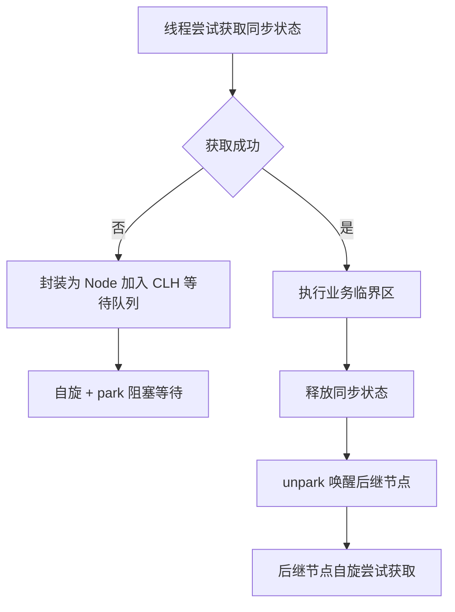

# AQS

## 面试常见问法

- AQS 是什么？
- AQS 的核心思想是什么？
- 哪些 JUC 工具基于 AQS 实现？
- AQS 中 state 和等待队列分别有什么作用？

## 核心回答

AQS 是 `AbstractQueuedSynchronizer`，是 JUC 中很多同步器的基础框架。它的核心思想是用一个 `state` 表示同步状态，用 FIFO 等待队列管理获取同步状态失败的线程。不同同步器通过定义获取和释放 state 的逻辑，实现独占锁、共享锁、信号量、倒计时门闩等能力。业务开发通常不直接继承 AQS，但理解它有助于理解 `ReentrantLock`、`Semaphore`、`CountDownLatch` 等工具。

## 背景

在 JUC 中，`ReentrantLock`、`ReentrantReadWriteLock`、`Semaphore`、`CountDownLatch`、`CyclicBarrier`（间接）等同步工具虽然功能不同，但底层都需要解决两个问题：如何表示同步状态、如何管理等待线程。AQS 将这两个问题抽象为统一的框架，子类只需实现 `tryAcquire`/`tryRelease`（独占）或 `tryAcquireShared`/`tryReleaseShared`（共享）方法，队列管理和线程调度由 AQS 统一处理。面试中 AQS 是考察并发底层原理的高频题，通常从 `ReentrantLock` 的实现切入追问。

## 核心概念



> AQS 的等待队列是 CLH 锁的变体，使用双向链表实现。每个等待线程被封装为一个 `Node`，Node 中记录了线程引用、等待状态（`waitStatus`）和前驱/后继指针。头节点（`head`）代表当前持有锁的线程，新加入的线程追加到队列尾部（`tail`）。

## 项目结合

业务中通常不直接写 AQS，而是使用基于 AQS 的成熟工具。例如限制本地并发数时，可以使用 `Semaphore`。

```java
public class LocalConcurrentLimiter {
    private final Semaphore semaphore = new Semaphore(20);

    public void execute(Runnable task) throws InterruptedException {
        // 获取许可失败时会等待，用于限制本地同时执行的任务数量
        semaphore.acquire();
        try {
            task.run();
        } finally {
            // 任务结束后释放许可，避免并发额度被永久占用
            semaphore.release();
        }
    }
}
```

## 深入追问

- **AQS 支持哪些模式？** 独占模式（Exclusive）和共享模式（Shared）。独占模式下同一时刻只有一个线程能获取同步状态，如 `ReentrantLock`；共享模式下多个线程可以同时获取，如 `Semaphore`（多个许可）和 `CountDownLatch`（等待计数归零）。`ReentrantReadWriteLock` 同时使用两种模式——读锁是共享模式，写锁是独占模式。

- **`ReentrantLock` 怎么使用 AQS？** 内部维护 `Sync extends AQS`。`state = 0` 表示锁未被持有；`lock()` 时通过 `compareAndSetState(0, 1)` 尝试获取锁，成功则设置 `exclusiveOwnerThread` 为当前线程；失败则加入 CLH 队列等待。同一线程重入时 `state` 递增，`unlock()` 时 `state` 递减，归零时释放锁并唤醒后继节点。非公平锁的 `tryAcquire` 会先尝试 CAS 抢锁再检查队列，公平锁会先检查队列中是否有等待线程（`hasQueuedPredecessors`）。

- **`Semaphore` 怎么使用 AQS？** `state` 表示剩余许可数量。`acquire()` 时调用 `tryAcquireShared`，通过 CAS 将 state 减一，如果减后 < 0 则加入等待队列。`release()` 将 state 加一，并唤醒等待队列中的线程。

- **`CountDownLatch` 怎么使用 AQS？** `state` 初始化为计数值。`countDown()` 将 state 减一（`tryReleaseShared`），`await()` 判断 state 是否为 0（`tryAcquireShared`），不为 0 则加入等待队列。当最后一个 `countDown()` 将 state 减到 0 时，唤醒所有等待线程。

- **CLH 队列入队的细节？** 新线程获取锁失败时，AQS 会创建一个 `Node`，通过 CAS 将其设置为 `tail`（`compareAndSetTail`）。如果 CAS 失败（有竞争），进入 `enq` 方法自旋重试直到成功。入队后，线程会检查前驱节点的 `waitStatus`，如果前驱是 `SIGNAL` 状态则安全 park；否则通过 CAS 将前驱设置为 `SIGNAL`，再自旋一次确认后 park。释放锁时，头节点 unpark 后继节点，后继节点被唤醒后继续自旋尝试获取锁。

- **为什么不建议业务里自己继承 AQS？** 实现复杂，需要正确处理 CAS、等待状态转换、中断响应和超时机制，容易产生难排查的并发 bug。JUC 已经提供了覆盖大部分场景的成熟工具。

## 常见问题

- **不要把 AQS 当作直接业务工具**：它是框架级抽象，业务代码应使用 `ReentrantLock`、`Semaphore`、`CountDownLatch` 等上层工具。
- **不要只背 state，还要讲等待队列**：面试中只说"AQS 有个 state"是不够的，必须能说清楚获取失败后线程如何入队、如何被唤醒。CLH 队列的入队和唤醒机制是核心。
- **不要把独占模式和共享模式混淆**：独占模式下 `tryAcquire`/`tryRelease` 返回 boolean；共享模式下 `tryAcquireShared` 返回 int（负数表示失败、0 表示成功但后续不能继续获取、正数表示成功且后续可能还能获取）。
- **注意 `waitStatus` 的含义**：`0` 是初始状态；`SIGNAL(-1)` 表示后继节点需要被唤醒；`CANCELLED(1)` 表示线程已取消等待；`CONDITION(-2)` 表示在条件队列中等待；`PROPAGATE(-3)` 用于共享模式的传播唤醒。

## 线上案例

**Semaphore 许可未释放导致线程全部阻塞**：某服务使用 `Semaphore(10)` 限制对第三方接口的并发调用数。但在调用第三方接口抛出异常时，`release()` 没有放在 `finally` 中，导致许可被永久占用。随着异常请求的累积，10 个许可逐渐耗尽，后续所有请求在 `acquire()` 处阻塞。监控上表现为接口 RT 持续增长，最终超时。通过 `jstack` 发现大量线程 WAITING 在 `Semaphore.acquire()`，同时 `Semaphore` 的 `availablePermits()` 返回 0。修复方案是将 `release()` 移入 `finally` 块（与 [ReentrantLock](./08-ReentrantLock.md) 的规范一致），并增加 `tryAcquire(timeout)` 超时机制避免无限等待。

## 相关笔记

- [ReentrantLock](./08-ReentrantLock.md)：最典型的 AQS 独占模式实现，理解 AQS 的最佳入口。
- [synchronized](./07-synchronized.md)：JVM 层面的内置锁，与 AQS 实现的显式锁对比是面试高频考点。
- [BlockingQueue](./05-BlockingQueue.md)：`ArrayBlockingQueue` 内部使用基于 AQS 的 `ReentrantLock` + `Condition`。
- [ConcurrentHashMap](./03-ConcurrentHashMap.md)：JDK 7 的 `Segment` 继承自 `ReentrantLock`，底层基于 AQS。

## 一句话总结

AQS 是 JUC 同步器的基础框架，面试重点是 `state` 的语义映射（重入次数/许可数/计数值）、CLH 等待队列的入队与唤醒机制、独占与共享模式的区别、以及 `ReentrantLock`/`Semaphore`/`CountDownLatch` 的具体映射。
