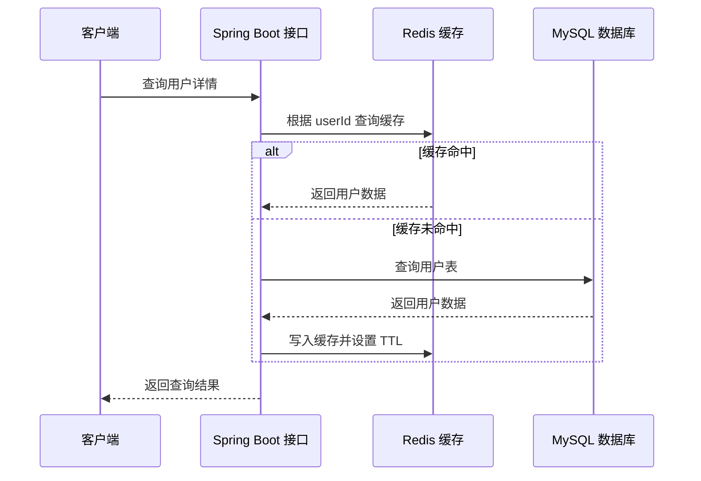

# AGENTS.md

## 作者背景

本知识库作者是一名拥有 5 年以上经验的资深 Java 后端工程师，长期关注 Java 语言、JVM、Spring 生态、数据库、中间件、分布式系统、工程效能、线上稳定性和系统设计。

本知识库主要服务于 Java 后端面试准备。知识组织必须围绕面试场景展开，既要能回答“是什么、为什么、怎么用”，也要能应对面试官进一步追问原理、边界、取舍和项目实践。

作者的知识沉淀目标不是收集零散概念，而是把技术理解转化为可复用的面试表达和工程经验，包括：

- 能解释原理，也能落到真实业务场景。
- 能识别技术取舍，而不是只记录标准答案。
- 能沉淀代码示例、排查路径、设计模板和复盘材料。
- 能服务于日常开发、架构设计、问题排查、技术分享和面试准备。
- 能把复杂知识整理成适合面试表达的回答结构、追问路径和总结话术。

## 会话、输入输出规则

- 必须使用简体中文。
- 编写代码时，关键代码逻辑处必须增加注释，注释必须使用简体中文。
- 新建或整理知识内容时，必须与作者的 Java 后端工程师背景匹配。
- 新建或整理知识内容时，必须优先面向面试准备场景进行解释、总结和组织。
- 不要只写抽象概念，必须结合工程实践、业务场景、线上问题或代码示例说明。
- 如果内容涉及流程、架构、调用链、状态流转、线程模型、缓存一致性、事务边界等，必要时使用 Mermaid 图展示。

## 知识内容写作要求

### 1. 内容要匹配资深 Java 后端视角

沉淀知识时优先关注以下问题：

- 这个知识点在 Java 后端开发中解决什么问题？
- 在 Spring、MyBatis、Redis、MQ、MySQL、Kubernetes 等常见技术栈中如何体现？
- 它在高并发、高可用、数据一致性、性能优化、可观测性中有什么影响？
- 有哪些常见误区、边界条件和线上风险？
- 在实际项目中如何设计、编码、测试、上线和回滚？
- 面试中如何用 1 到 3 分钟讲清楚这个知识点？
- 面试官可能继续追问哪些底层原理、项目细节和技术取舍？

### 2. 内容要面向面试场景组织

每篇技术笔记都应优先围绕面试复习展开，建议包含：

- 面试常见问法：记录这个知识点在面试中常见的提问方式。
- 核心回答：给出适合口述的结构化回答，避免散点式背诵。
- 深入追问：补充面试官可能继续追问的原理、源码、边界和对比。
- 项目结合：说明如何把概念关联到真实 Java 后端项目经验。
- 易错点：总结容易答错、答浅或混淆的地方。
- 一句话总结：沉淀适合面试收尾的简洁表达。

### 3. 阐述概念必须结合实际

解释概念时推荐采用以下结构：

```text
面试问法 -> 核心回答 -> 概念定义 -> 使用场景 -> 实际案例 -> 代码示例 -> 深入追问 -> 常见问题 -> 总结
```

例如说明 Redis 缓存穿透时，不只写定义，还应说明：

- 哪类接口容易出现缓存穿透。
- 请求链路如何落到数据库。
- 如何使用空值缓存、布隆过滤器或参数校验处理。
- 对 Java 代码结构、过期时间、监控指标有什么要求。

### 4. 必须搭配代码示例

涉及 Java、Spring、SQL、Shell、配置文件等内容时，应尽量给出可读、可迁移的示例。

示例代码要求：

- 优先使用 Java、Spring Boot、MyBatis、SQL、Redis、MQ 等后端常用技术栈。
- 代码应尽量贴近真实项目，而不是玩具示例。
- 关键逻辑处必须使用简体中文注释。
- 示例要说明适用场景和限制条件。

Java 示例风格：

```java
public UserDTO getUserById(Long userId) {
    if (userId == null || userId <= 0) {
        throw new IllegalArgumentException("用户ID非法");
    }

    String cacheKey = "user:" + userId;
    UserDTO cachedUser = redisTemplate.opsForValue().get(cacheKey);
    if (cachedUser != null) {
        return cachedUser;
    }

    // 缓存未命中时查询数据库，避免把缓存逻辑散落在多个业务入口
    UserDO user = userMapper.selectById(userId);
    if (user == null) {
        // 对不存在的数据设置短 TTL，降低缓存穿透对数据库的冲击
        redisTemplate.opsForValue().set(cacheKey, UserDTO.empty(), Duration.ofMinutes(1));
        return null;
    }

    UserDTO result = UserDTO.from(user);
    redisTemplate.opsForValue().set(cacheKey, result, Duration.ofMinutes(10));
    return result;
}
```

### 5. 必要时使用 Mermaid 图

当文字不足以清晰表达结构或流程时，应使用 Mermaid 图，包括但不限于：

- 系统架构图
- 请求调用链路
- 状态机
- 时序图
- 数据流图
- 故障排查流程
- 事务和一致性边界

示例：



## 目录使用规则

- `00-总览与方法论`：存放知识库规范、写作模板、复盘模板、职业成长规划。
- `01-Java核心与JVM`：存放 Java 语言、集合、并发、JVM、性能调优和源码阅读。
- `02-后端基础`：存放网络、操作系统、算法、设计模式、编码规范等基础能力。
- `03-框架与中间件`：存放 Spring、MyBatis、MQ、缓存、搜索、任务调度等工程实践。
- `04-数据库与存储`：存放 MySQL、Redis、PostgreSQL、MongoDB、分库分表和数据建模。
- `05-分布式与架构`：存放分布式理论、微服务、高可用、一致性、架构设计与评审。
- `06-工程效能`：存放 Git、构建、测试、CI/CD、代码质量和研发流程。
- `07-云原生与运维`：存放 Linux、Docker、Kubernetes、可观测性、发布回滚和云服务。
- `08-安全与合规`：存放 Web 安全、认证授权、数据安全和安全排查案例。
- `09-性能优化与稳定性`：存放压测、容量规划、故障排查、线上复盘和稳定性治理。
- `10-系统设计与案例`：存放业务系统设计、技术方案、经典系统拆解和面试系统设计。
- `11-业务与产品`：存放领域建模、需求分析、行业知识和产品思维。
- `12-AI与数据工程`：存放 AI 工程化、大模型应用、数据处理、推荐与搜索实践。
- `13-阅读与输出`：存放书籍笔记、文章摘录、技术博客和分享材料。
- `99-归档与素材`：存放临时收集、图片附件、历史资料和废弃草稿。

## 新增笔记建议模板

新增技术笔记时优先使用以下结构：

```markdown
# 标题

## 面试常见问法

记录面试中可能出现的提问方式。

## 核心回答

用适合口述的方式回答，先给结论，再展开关键点。

## 背景

说明这个问题在什么业务、系统或工程场景下出现。

## 核心概念

用简体中文解释关键概念，避免只堆定义。

## 实际场景

结合 Java 后端项目说明使用方式、边界和风险。

## 示例代码

给出 Java、SQL、配置或脚本示例，关键逻辑处使用简体中文注释。

## 流程或原理图

必要时使用 Mermaid 展示调用链路、状态流转或架构关系。

## 常见问题

记录易错点、线上风险、排查思路和优化方向。

## 深入追问

补充面试官可能继续追问的底层原理、源码细节、边界条件和技术取舍。

## 总结

沉淀适合面试收尾的一句话总结，避免只停留在资料摘抄。
```

## 质量标准

- 内容要能被未来的自己复用，而不是只服务于当下记忆。
- 优先沉淀真实问题、真实代码、真实取舍。
- 重要结论要说明前提条件，避免绝对化表达。
- 面向复杂主题时，优先拆成多个小笔记并互相引用。
- 对过期内容要标注时间、版本和适用范围。
